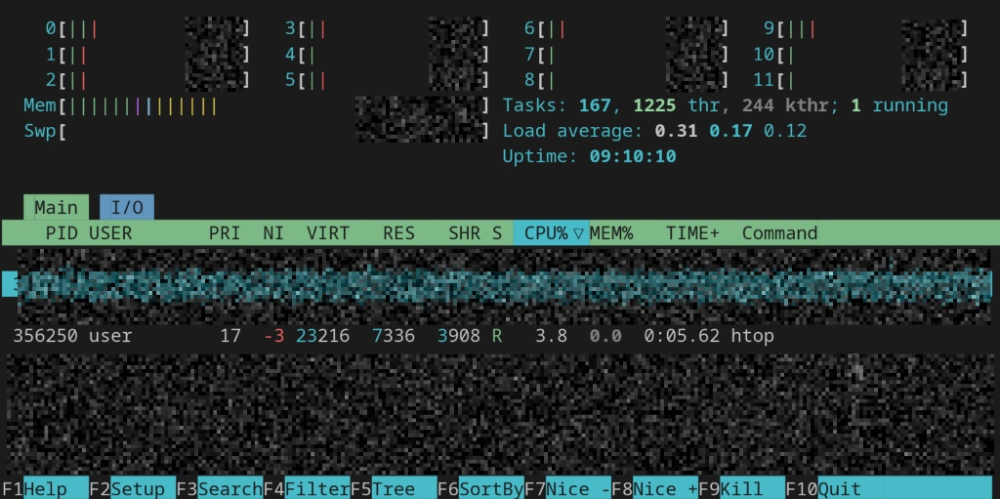

# Linux troubleshooting runbook

Target Service: Docker

Purpose:
This runbook provides quick troubleshooting steps if the Docker service goes down.

---

## Environment basics

- Verified Kernel Information like kernel version and system architecture

```
guy@localhost:~$ uname -a
Linux localhost 7.0.11-generic #1 SMP PREEMPT_DYNAMIC x86_64 x86_64 x86_64 GNU/Linux
```

---

- Checked and confirmed OS distribution and release version
```
guy@localhost:~$ cat /etc/os-release
NAME="Ubuntu"
VERSION="24.04"
ID=ubuntu
ID_LIKE="ubuntu debian"
PRETTY_NAME="Ubuntu 24.04.3 LTS"
VERSION_ID="24.04.3 LTS (Noble Numbat)"
HOME_URL=...
SUPPORT_URL=...
BUG_REPORT_URL=...
PRIVACY_POLICY_URL=...
VERSION_CODENAME=...
UBUNTU_CODENAME=...
LOGO=...
```

---

## File-system sanity checks

- Temporary directory created successfully. Copied the files from /etc/hosts. Filesystem is writable and permissions verified.
```
guy@localhost:~$ cp /etc/hosts /tmp/runbook-demo/hosts-copy
guy@localhost:~$ ls -l /tmp/runbook-demo
total 4
-rw-r--r-- 1 user user 352 Sep  5 17:39 hosts-copy
```

---

## CPU & Memory

- Monitor System Usage checked using `htop`. Process running and CPU & Memory usage is negligible. Sufficient memory available.
```
guy@localhost:~$ htop
```


---

- Checked memory usage. Available memory was sufficient. No memory pressure observed.
```
guy@localhost:~$ free -h
               total        used        free      shared  buff/cache   available
Mem:                                                 
Swap:
```

---

## Disk & IO

- Checked disk usage. Root partition had enough free space. No disk saturation issues found.
```
guy@localhost:~$ df -h
Filesystem             Size  Used Avail Use% Mounted on
tmpfs                  ...  ...     ...     ....
...
...                                                   
```

- Checked CPU and storage I/O performance across physical and logical drives using `iostat`. Near-zero CPU load. No storage bottlenecks. Light disk activity. Mapped storage layers.
```
guy@localhost:~$ iostat
Linux 7.0.11-768478411-generic (localhost) 	

avg-cpu:  %user   %nice %system %iowait  %steal   %idle
           1.55    0.03    0.47    0.18    0.00   97.77

Device             tps    kB_read/s    kB_wrtn/s    kB_dscd/s    kB_read    kB_wrtn    kB_dscd
dm-0             ...    ...             ...             ...         ...         ...      ...
dm-1             ...    ...             ...             ...         ...         ...      ...
nvme0n1           ...   ...             ...             ...         ...         ...      ...
zram0             ...   ...             ...             ...         ...         ...      ...
```

---

## Network

To check this pulled a Lightweight Image and ran a container with a port mapping.
```
guy@localhost:~$ sudo docker pull alpine
Using default tag: latest
latest: Pulling from library/alpine
...
...
Status: Downloaded newer image for alpine:latest
docker.io/library/alpine:latest

guy@localhost:~$ sudo docker run --rm -d -p 8080:80 --name test-dummy alpine sleep 3600
490c43a...                                      
```

- Checked open ports. Docker service listening on expected ports.
```
guy@localhost:~$ sudo ss -tulpn | grep -i docker
tcp   LISTEN 0      4096                              0.0.0.0:8080       0.0.0.0:*    users:(("docker-proxy",pid=390725, fd=7))                                                                                                                                                                                                                           
tcp   LISTEN 0      4096                                 [::]:8080          [::]:*    users:(("docker-proxy",pid=390732,fd=7)) 
                              
```

---

- Test network connectivity.Internet connectivity working correctly.
```
guy@localhost:~$ curl -I https://google.com
HTTP/2 301
location: https://www.google.com/
content-type: text/html; charset=UTF-8
content-security-policy-report-only: object-src 'none';base-uri 'self';script-src 'nonce-zTIjyD12gdU5XwQ6npUihA' 'strict-dynamic' 'report-sample' 'unsafe-eval' 'unsafe-inline' https: http:;report-uri https://csp.withgoogle.com/csp/gws/other-hp
date: Sat, 05 Sep 2026 13:15:51 GMT
...
...
```

---

## Logs

- Reviewed Docker logs. Docker daemon started successfully. No critical errors found in recent logs.
```
guy@localhost:~$ journalctl -u docker -n 50 | tail -5
Sep 05 08:43:15 localhost dockerd[1885]: time="2026-09-05T08:43:15.967222968+05:30" level=info msg="Daemon has completed initialization"
Sep 05 08:43:15 localhost dockerd[1885]: time="2026-09-05T08:43:15.967246222+05:30" level=info msg="API listen on /run/docker.sock"
Sep 05 08:43:15 localhost systemd[1]: Started docker.service - Docker Application Container Engine.
Sep 05 18:33:23 localhost dockerd[1885]: time="2026-09-05T18:33:23.555212428+05:30" level=info msg="image pulled" digest="sha256:28bd5fe8b56d1bd048e5babf5b10710ebe0bae67db86916198a6eec434943f8b" remote="docker.io/library/alpine:latest"
Sep 05 18:33:55 localhost dockerd[1885]: time="2026-09-05T18:33:55.427488224+05:30" level=info msg="sbJoin: gwep4 ''->'d611c1380c39', gwep6 ''->''" eid=d611c1380c39 ep=test-dummy net=bridge nid=1e0d7c6f8207
```

---

- Reviewed system logs. No suspicious activity detected. System logs showed normal background activity. No major failures detected.
```
guy@localhost:~$ tail -n 50 /var/log/syslog
```

---

## Quick Findings

- Docker service running normally with low CPU usage
- CPU and memory usage stable
- Disk and logs size is healthy
- Network connectivity working
- No critical errors in logs

---

## If This Worsens

- Next Steps:

1. Restart Docker service using:
```
systemctl restart docker
```
2. Increase log investigation and monitor live logs:
```
journalctl -fu docker
```
3. Collect deeper debugging information using:
```
strace -p <PID>
```