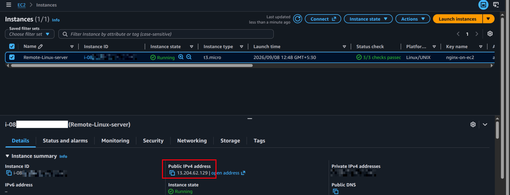
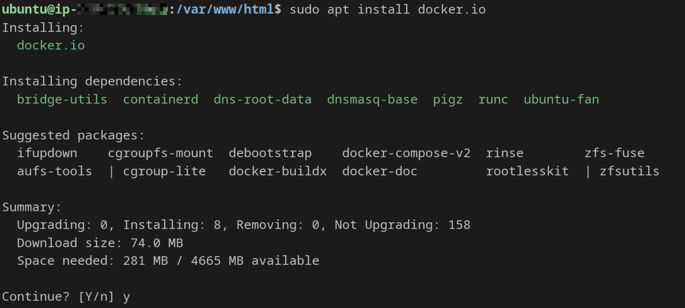
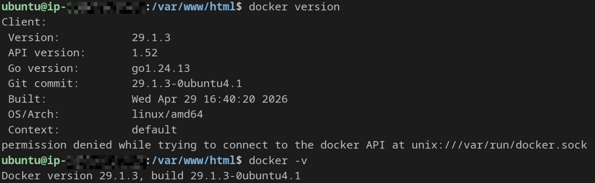
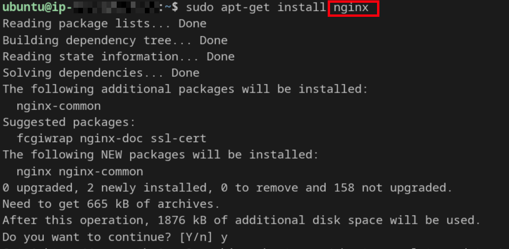
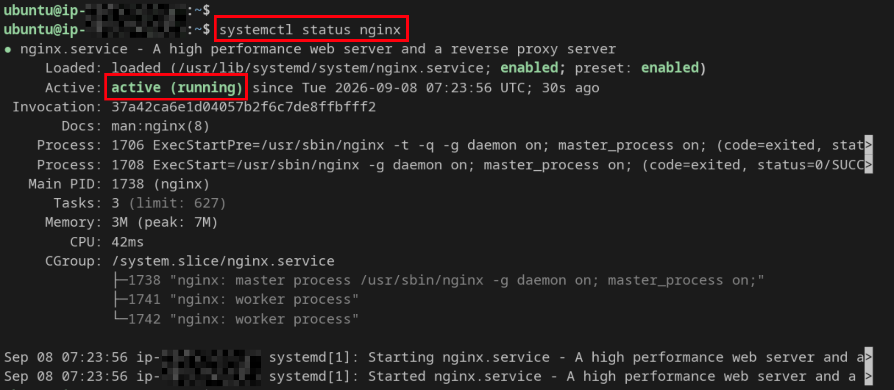
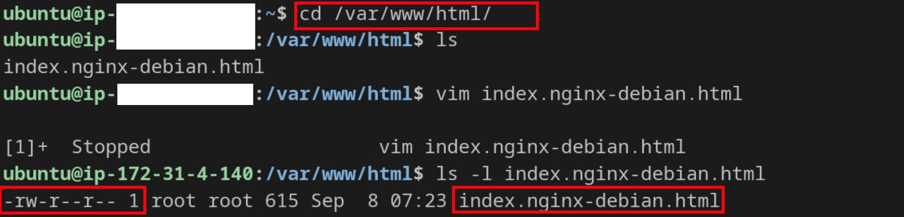
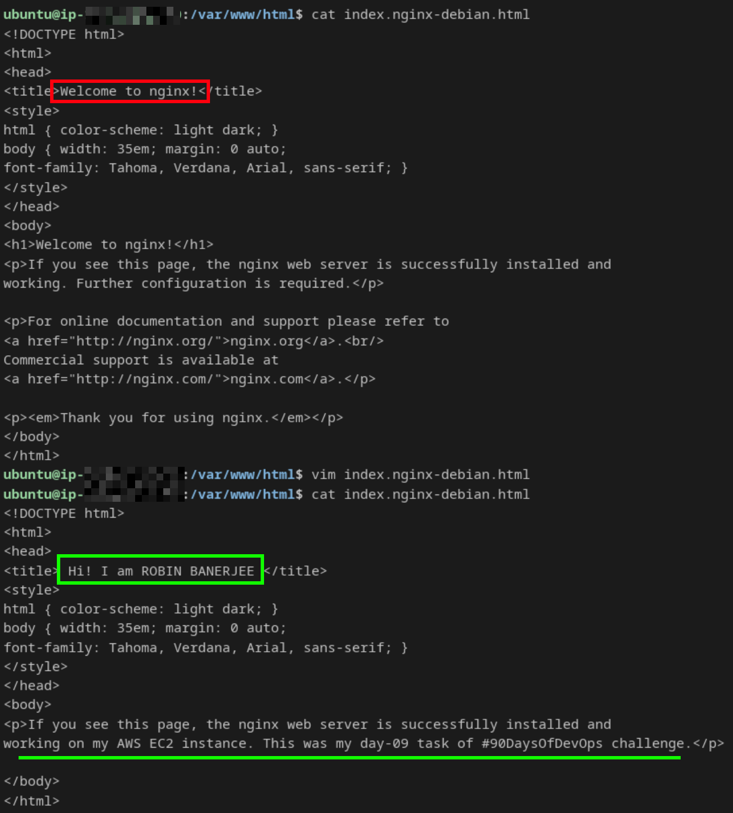
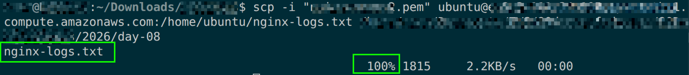
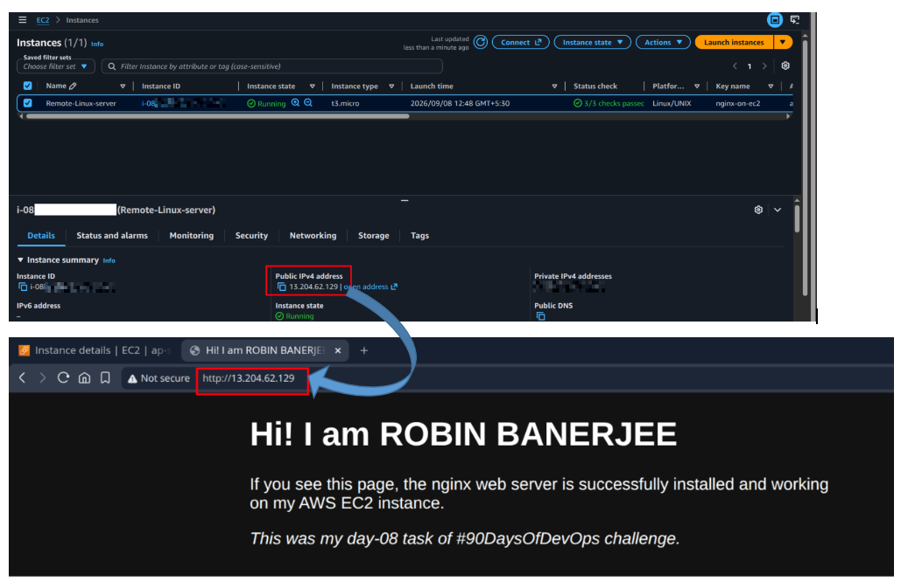
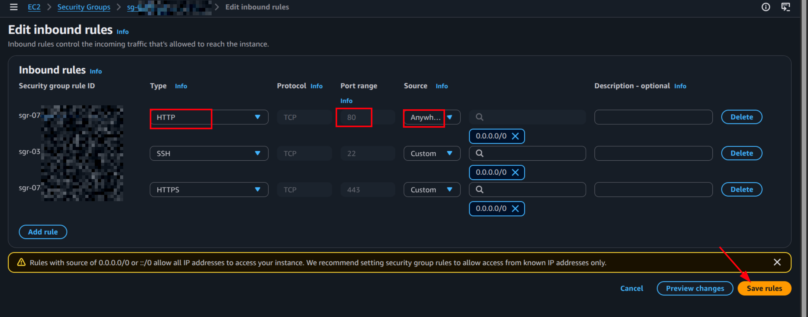

# Day 08 – Deploy a Real Web Server on the Cloud

# Commands Used

## Connect to Server

Step 1 : Launch an instance from AWS console.


Step 2 : Connect to instance using ssh.
    
Command :

```bash
ssh -i "<downloaded-private-key>.pem" username@<instance-Public-DNS>
```

---

## Update System

```bash
sudo apt update && sudo apt upgrade -y
```

---

## Install Docker

```bash
sudo apt install docker.io
```


Verify Docker:

```bash
docker -v
```


---

## Install Nginx

```bash
sudo apt install nginx
```


Start Nginx:

```bash
sudo systemctl start nginx
sudo systemctl enable nginx
```

Check Status:

```bash
sudo systemctl status nginx
```



Customize nginx web page:





---

## View Nginx Logs

```bash
sudo tail -n 20 /var/log/nginx/access.log
```

---

## Save Logs to File

```bash
sudo cp /var/log/nginx/access.log ~/nginx-logs.txt
```


---

## Download Logs to Local Machine

```bash
scp -i my-key.pem ubuntu@<instance-Public-DNS>:~/nginx-logs.txt <local/destination/to/copy/nginx-logs.txt>
```


[Nginx-log file from remote server](nginx-logs.txt)

---

# Security Group Configuration

Allowed Inbound Rules:
- SSH → Port 22
- HTTP → Port 80

Verified Nginx webpage using:

```bash
http://<your-instance-ip>
```


Successfully accessed Nginx welcome page from browser.

---

# Challenges Faced

* Unable to access Nginx using the public IP.

 Solution: I had forgotten to add port 80 to the security group inbound rules. Once added, Nginx became accessible.



* My custom HTML page was not loading on the webpage because i was trying to access to with HTTPS protocol instead of HTTP.
```
Error: 

This site can’t be reached
<Public IPv4 address of my EC2 instance> refused to connect.
Try:

Checking the connection
Checking the proxy and the firewall
ERR_CONNECTION_REFUSED
```


 Solution: I reloaded the Nginx service with **http**://< Public-IPv4-address-of-EC2-instance>. After reloading, my customized.html page was accessible.

* File permissions issue when accessing logs.

 Solution : Needed sudo to read /var/log/nginx/access.log.

---

# What I Learned

* Connect to an AWS cloud instance using SSH.

* How to manage security group (adding inbound rules)

* How to install Nginx and serve a webpage.

* The importance of reloading a service after configuration changes or adding new files.

* How to transfer files securely from the instance to the local machine using scp.

* Confusion between journalctl and access logs. Learned that journalctl -u nginx shows service logs, while HTTP requests are recorded in /var/log/nginx/access.log.