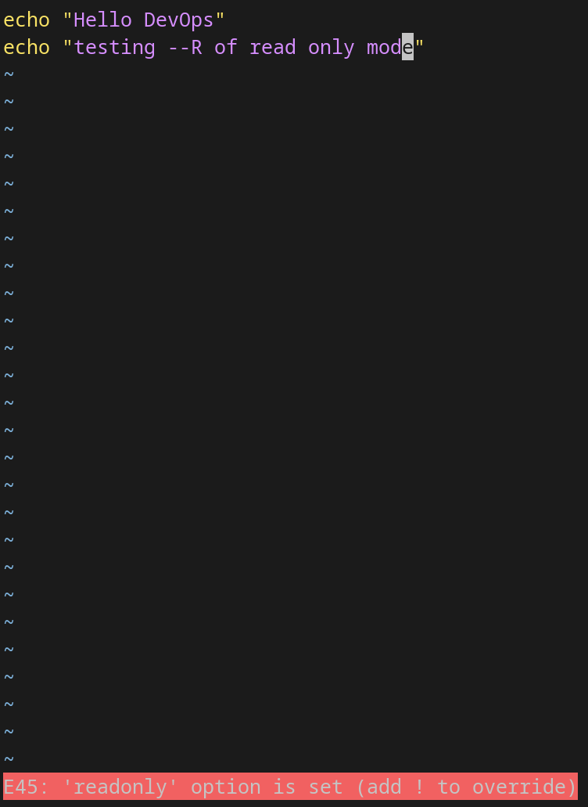

# File Permissions & File Operations Challenge

# Files & Folder Created in 2026/day-10/day10-practice

- devops.txt
- notes.txt
- script.sh
- project/

---

## Create Files

* Create empty file devops.txt using touch
* Create notes.txt with some content using cat or echo
* Create script.sh using vim with content: echo "Hello DevOps"


```
ubuntu@EC2-IPv4:~/90DaysOfDevOps/2026/day-10$ mkdir -p day10-practice
ubuntu@EC2-IPv4:~/90DaysOfDevOps/2026/day-10$ ls
day10-practice  file-permissions.md  README.md
ubuntu@EC2-IPv4:~/90DaysOfDevOps/2026/day-10$ cd day10-practice/

ubuntu@EC2-IPv4:~/day-10/day10-practice$ touch devops.txt
ubuntu@EC2-IPv4:~/day-10/day10-practice$ echo "notes for day 10 of 90DaysOfDevOps" > notes.txt
ubuntu@EC2-IPv4:~/day-10/day10-practice$ vim script.sh

```

---

## Verify File Permissions

```
ubuntu@EC2-IPv4:~/day-10/day10-practice$ ls -lt
total 8
-rw-rw-r-- 1 ubuntu ubuntu 21 Sep 10 17:45 script.sh
-rw-rw-r-- 1 ubuntu ubuntu 35 Sep 10 17:44 notes.txt
-rw-rw-r-- 1 ubuntu ubuntu  0 Sep 10 17:42 devops.txt
```

---

# Read Files

## Read notes.txt

```
ubuntu@EC2-IPv4:~/day-10/day10-practice$ cat notes.txt
notes for day 10 of 90DaysOfDevOps
```

---

## Open script.sh in Read-Only Mode

```
ubuntu@EC2-IPv4:~/day-10/day10-practice$ vim -R script.sh
```


---

## First 5 Lines of /etc/passwd

```
ubuntu@EC2-IPv4:~/day-10/day10-practice$ head -n 5 /etc/passwd
root:x:0:0:root:/root:/bin/bash
daemon:x:1:1:daemon:/usr/sbin:/usr/sbin/nologin
bin:x:2:2:bin:/bin:/usr/sbin/nologin
sys:x:3:3:sys:/dev:/usr/sbin/nologin
sync:x:4:65534:sync:/bin:/bin/sync
```

---

## Last 5 Lines of /etc/passwd

```
ubuntu@EC2-IPv4:~/day-10/day10-practice$ tail -n 5 /etc/passwd
guest:x:1004:1004::/home/guest:/bin/sh
tokyo:x:1005:1006::/home/tokyo:/bin/sh
berlin:x:1007:1007:berlin,,,:/home/berlin:/bin/bash
professor:x:1008:1008:professor,,,:/home/professor:/bin/bash
nairobi:x:1009:1011::/home/nairobi:/bin/sh
```

---

# Understanding Permissions

Permission Format:

```text
rwxrwxrwx
```

- r = read (4)
- w = write (2)
- x = execute (1)

Checked permissions using:

```bash
ubuntu@EC2-IPv4:~/day-10/day10-practice$ ls -l devops.txt notes.txt script.sh
-rw-rw-r-- 1 ubuntu ubuntu  0 Sep 10 17:42 devops.txt
-rw-rw-r-- 1 ubuntu ubuntu 35 Sep 10 17:44 notes.txt
-rw-rw-r-- 1 ubuntu ubuntu 21 Sep 10 17:45 script.sh
```

Observed:
* Current permissions :

  Devops.txt : -rw-rw-r--
  
  - `-`     → indicates it’s a regular file (not a directory or special file).
  - `rw-` → (user/owner) → read + write, no execute.
  - `rw-` → (group) → read + write, no execute.
  - `r--` → (others) → read only, no write or execute.

* Same permissions applied to notes.txt and script.sh.

---

# Modify Permissions

- Make script.sh Executable
```
ubuntu@EC2-IPv4:~/day-10/day10-practice$ chmod +x script.sh

ubuntu@EC2-IPv4:~/day-10/day10-practice$ ls -l script.sh
-rwxrwxr-x 1 ubuntu ubuntu 21 Sep 10 17:45 script.sh
```
Run script:
```
ubuntu@EC2-IPv4:~/day-10/day10-practice$ ./script.sh
Hello DevOps
```

---

- Make devops.txt Read-Only (remove write for all)
```
ubuntu@EC2-IPv4:~/day-10/day10-practice$ chmod -w devops.txt

ubuntu@EC2-IPv4:~/day-10/day10-practice$ ls -l devops.txt
-r--r--r-- 1 ubuntu ubuntu 0 Sep 10 17:42 devops.txt
```

---

- Set notes.txt Permission to 640 (owner: rw, group: r, others: none)
```
ubuntu@EC2-IPv4:~/day-10/day10-practice$ chmod 640 notes.txt

ubuntu@EC2-IPv4:~/day-10/day10-practice$ ls -l notes.txt
-rw-r----- 1 ubuntu ubuntu 35 Sep 10 17:44 notes.txt
```

---

- Create Directory with 755 Permission (Only ubuntu user who creates project/ should be allowed to delete/modify own files and rest of all users should limit to read-execute permission [755] in this shared directory)
```
ubuntu@EC2-IPv4:~/day-10/day10-practice$ mkdir -m 755 project
```

---

# Verify Updated Permissions
```
ubuntu@EC2-IPv4:~/day-10/day10-practice$ ls -lt
total 12
drwxr-xr-x 2 ubuntu ubuntu 4096 Sep 10 18:22 project
-rwxrwxr-x 1 ubuntu ubuntu   21 Sep 10 17:45 script.sh
-rw-r----- 1 ubuntu ubuntu   35 Sep 10 17:44 notes.txt
-r--r--r-- 1 ubuntu ubuntu    0 Sep 10 17:42 devops.txt
```

---

# Test Permissions

## Writing to a read-only file - what happens?

```
ubuntu@EC2-IPv4:~/day-10/day10-practice$ echo "writing to a read-only file" >> devops.txt
bash: devops.txt: Permission denied

ubuntu@EC2-IPv4:~/day-10/day10-practice$ echo "writing to a read-only file" | sudo tee -a devops.txt
[sudo] password for user:
writing to a read-only file

ubuntu@EC2-IPv4:~/day-10/day10-practice$ cat devops.txt
writing to a read-only file
```

Observed:
- Writing to a read‑only file normally gives `Permission denied`. With sudo, you can override and write to the file, but only if the redirection itself is executed with root privileges (using tee or sudo bash -c). Even sudo won’t help if the file is set to immutable (via chattr +i) or mounted on a read‑only filesystem.

---

## Trying to Executing File Without Execute Permission

```
ubuntu@EC2-IPv4:~/day-10/day10-practice$ chmod -x script.sh
ubuntu@EC2-IPv4:~/day-10/day10-practice$ ls -l script.sh
-rw-rw-r-- 1 ubuntu ubuntu 21 Sep 10 17:45 script.sh

ubuntu@EC2-IPv4:~/day-10/day10-practice$ ./script.sh
bash: ./script.sh: Permission denied

ubuntu@EC2-IPv4:~/day-10/day10-practice$ sudo ./script.sh
sudo: ./script.sh: command not found
ubuntu@EC2-IPv4:~/day-10/day10-practice$ bash script.sh
Hello DevOps
```

Observed:
- Executing a file without execute permission gives `Permission denied`. Even sudo cannot bypass this, because the shell requires the execute bit. However, you can still run the file by explicitly invoking the interpreter (e.g., bash script.sh or python3 script.py).

---

# What I Learned

- Managing files permissions effectively by understanding difference between read, write, and execute permissions.
- How to modify permissions using chmod
- Using sudo can override read & write restrictions.But sudo cannot override execute permission, though calling the interpreter directly allows execution.