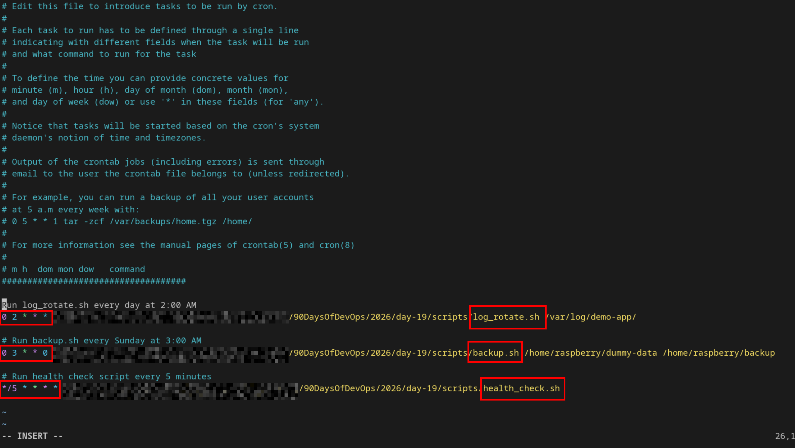

# Day 19 – Shell Scripting Project: Log Rotation, Backup & Crontab

## Task 1: Log Rotation Script
Create `log_rotate.sh` that:
1. Takes a log directory as an argument (e.g., `/var/log/myapp`)
2. Compresses `.log` files older than 7 days using `gzip`
3. Deletes `.gz` files older than 30 days
4. Prints how many files were compressed and deleted
5. Exits with an error if the directory doesn't exist

    [Here is the script log_rotate.sh](scripts/log_rotate.sh)
   
```bash
raspberry@pi:/90DaysOfDevOps/2026/day-19/scripts$ ls -lt /var/log/demo-app/
total 0
-rwxrwxrwx 1 root root 0 Sep 22 09:02 error.log.4
-rwxrwxrwx 1 root root 0 Sep 22 08:58 access.log
-rwxrwxrwx 1 root root 0 Sep 22 08:58 other_vhosts_access.log
-rwxrwxrwx 1 root root 0 Sep 21 08:00 error.log
-rwxrwxrwx 1 root root 0 Sep 10 12:00 error.log.1
-rwxrwxrwx 1 root root 0 Sep  2 12:00 error.log.2
-rwxrwxrwx 1 root root 0 Sep  1 12:00 error.log.1.gz
-rwxrwxrwx 1 root root 0 Aug 28 12:00 error.log.3
-rw-r--r-- 1 root root 0 Aug  1 12:00 error.log.4.gz

raspberry@pi:/90DaysOfDevOps/2026/day-19/scripts$ ./log_rotate.sh /var/log/demo-app/
gzip: /var/log/demo-app/error.log.1.gz already exists; do you wish to overwrite (y or n)? y
rm: remove write-protected regular empty file '/var/log/demo-app/error.log.4.gz'? y
Total Log Files Zipped  : 3
Total Zip Files Deleted : 1

raspberry@pi:/90DaysOfDevOps/2026/day-19/scripts$ ls -lt /var/log/demo-app/
total 12
-rwxrwxrwx 1 root      root       0 Sep 22 09:02 error.log.4
-rwxrwxrwx 1 root      root       0 Sep 22 08:58 access.log
-rwxrwxrwx 1 root      root       0 Sep 22 08:58 other_vhosts_access.log
-rwxrwxrwx 1 root      root       0 Sep 21 08:00 error.log
-rwxrwxrwx 1 raspberry raspberry 32 Sep 10 12:00 error.log.1.gz
-rwxrwxrwx 1 raspberry raspberry 32 Sep  2 12:00 error.log.2.gz
-rwxrwxrwx 1 raspberry raspberry 32 Aug 28 12:00 error.log.3.gz

raspberry@pi:/90DaysOfDevOps/2026/day-19/scripts$ cat log_rotate.sh
#!/bin/bash

set -eu

###### Log Rotation Script #####
: 'Purpose
Automates log cleanup and compression.
Features:
Compresses old .log files
Deletes old compressed files
Saves disk space
Improves log management'

usage(){
	echo "Usage: ./log_rotate.sh /var/log/app_name"
	echo "Provide the directory of log files that you want to rotate."
	echo "Example : /var/log/Nginx"
	exit 1
}

check_dir(){
	find $dir &>/dev/null || { echo "No such directory"; exit 1; }
}

gzip_count=0
delete_count=0

#Compresses .log files older than 7 days using gzip and count how many files zipped
compress(){
	file_list=$(find $dir -name "*.log*" -mtime +7)
	for file in $file_list;do
		if [[ $file != *.gz ]];then
			gzip $file
			gzip_count=$((gzip_count + 1))
		fi
	done
}

#Deletes .gz files older than 30 days and count how many deleted
delete(){
	zip_file=$(find $dir -name "*.gz" -mtime +30)
	for file in $zip_file;do
		rm $file
		delete_count=$((delete_count + 1))
	done
}

dir=$1

if [ $# -eq 0 ];then
	usage
fi

check_dir
compress
delete

echo "Total Log Files Zipped  : $gzip_count"
echo "Total Zip Files Deleted : $delete_count"
```
   
---

## Task 2: Server Backup Script
Create `backup.sh` that:
1. Takes a source directory and backup destination as arguments
2. Creates a timestamped `.tar.gz` archive (e.g., `backup-2026-02-08.tar.gz`)
3. Verifies the archive was created successfully
4. Prints archive name and size
5. Deletes backups older than 14 days from the destination
6. Handles errors — exit if source doesn't exist

    [Here is the script backup.sh](scripts/backup.sh)
   
```bash
raspberry@pi:/90DaysOfDevOps/2026/day-19/scripts$ ls -l /home/raspberry/dummy-data
total 8
-rw-rw-r-- 1 raspberry raspberry 16 Sep 22 09:36 app.log
-rw-rw-r-- 1 raspberry raspberry 19 Sep 22 09:36 config.conf
raspberry@pi:/90DaysOfDevOps/2026/day-19/scripts$ ls -lt /home/raspberry/backup
total 0
-rw-rw-r-- 1 raspberry raspberry 0 Sep  1 10:00 backup-2026-09-01-10-00-00.tar.gz

raspberry@pi:/90DaysOfDevOps/2026/day-19/scripts$ vim backup.sh
raspberry@pi:/90DaysOfDevOps/2026/day-19/scripts$ ./backup.sh
Usage : backup.sh source/path destination/path
Example : backup.sh /home/raspberry/dummy-data /home/raspberry/backup
Please provide source and destination
raspberry@pi:/90DaysOfDevOps/2026/day-19/scripts$ ./backup.sh /home/raspberry/dummy-data /home/raspberry/backup
======Taking BackUp======
Back Up Complete

======Backup Taken======
Archive Name : backup-2026-09-22-09-42-00.tar.gz
Size : 229

======Removing archives older than 14 days======
Removed Archive : /home/raspberry/backup/backup-2026-09-01-10-00-00.tar.gz

raspberry@pi:/90DaysOfDevOps/2026/day-19/scripts$ ls -l /home/raspberry/dummy-data
total 8
-rw-rw-r-- 1 raspberry raspberry 16 Sep 22 09:36 app.log
-rw-rw-r-- 1 raspberry raspberry 19 Sep 22 09:36 config.conf
raspberry@pi:/90DaysOfDevOps/2026/day-19/scripts$ ls -lt /home/raspberry/backup
total 4
-rw-rw-r-- 1 raspberry raspberry 229 Sep 22 09:42 backup-2026-09-22-09-42-00.tar.gz

raspberry@pi:/90DaysOfDevOps/2026/day-19/scripts$ cat backup.sh
#!/bin/bash
set -eu

: '
Purpose:
Creates compressed backups of important directories.

Features:
Creates timestamped archives
Verifies backup creation
Removes old backups
Supports automation
'

#Check for arguments
usage(){
	echo "Usage : backup.sh source/path destination/path"
	echo "Example : backup.sh /home/raspberry/dummy-data /home/raspberry/backup"
	echo "Please provide source and destination"
	exit 1
}

#Check source/destination folder exists
check_source(){
	find $src &>/dev/null || { echo "Source directory doesn't exists"; exit 1; }
	find $dest &>/dev/null || { echo "Destination directory doesn't exists"; exit 1; }
}

#Take backup
backup(){
	echo "======Taking BackUp======"
	tar -czf $dest/backup-$(date +%Y-%m-%d-%H-%M-%S).tar.gz $src &>/dev/null && echo "Back Up Complete"
	echo
}

#Print archive name and size
print_file(){
	echo "======Backup Taken======"
	cd $dest
	ls -lh backup-$(date +%Y-%m-%d-%H-%M-%S).tar.gz | awk '{print "Archive Name : "$9,"\nSize : "$5}'
	cd
	echo
}

#delete archives older than 14 Days
delete(){
	
	archives=$(find $dest -name "*.tar.gz" -mtime +14)
	if [ -n "$archives" ];then
		echo "======Removing archives older than 14 days======"
		for file in $archives;do
			rm $file
			echo "Removed Archive : $file"
		done
	fi
}

if [ $# -lt 2 ];then
	usage
fi
src=$1
dest=$2
check_source
backup
print_file
delete
```
   
---

## Task 3: Crontab
View scheduled jobs:

```bash
crontab -l
```

Edit cron jobs:

```bash
crontab -e
```
Understand cron syntax:
   ```
   * * * * *  command
   │ │ │ │ │
   │ │ │ │ └── Day of week (0-7)
   │ │ │ └──── Month (1-12)
   │ │ └────── Day of month (1-31)
   │ └──────── Hour (0-23)
   └────────── Minute (0-59)
   ```
3. Cron entries for:
   - Run `log_rotate.sh` every day at 2 AM     : `0 2 * * *`
   - Run `backup.sh` every Sunday at 3 AM      : `0 3 * * 7`
   - Run a health check script every 5 minutes : `*/5 * * * *`


```bash
# Run log_rotate.sh every day at 2:00 AM
0 2 * * * /path/to/scripts/log_rotate.sh /var/log/demo-app/

# Run backup.sh every Sunday at 3:00 AM
0 3 * * 0 /path/to/scripts/backup.sh /what/to/backup /where/to/backup

# Run health check script every 5 minutes
*/5 * * * * /path/to/scripts/health_check.sh
```

```bash
raspberry@pi:/90DaysOfDevOps/2026/day-19/scripts$ crontab -l
no crontab for raspberry
raspberry@pi:/90DaysOfDevOps/2026/day-19/scripts$ crontab -e
no crontab for raspberry - using an empty one

Select an editor.  To change later, run 'select-editor'.
  1. /bin/nano        <---- easiest
  2. /usr/bin/vim.basic
  3. /usr/bin/code

Choose 1-3 [1]: 2
```


---

## Task 4: Combine — Scheduled Maintenance Script
Create `maintenance.sh` that:
1. Calls your log rotation function
2. Calls your backup function
3. Logs all output to `/var/log/maintenance.log` with timestamps
4. Write the cron entry to run it daily at 1 AM : `0 1 * * *`

    [Here is the script maintenance.sh](scripts/maintenance.sh)
   
```bash
raspberry@pi:~/90DaysOfDevOps/2026/day-19/scripts$ sudo ls -l /home/raspberry/dummy-data
total 8
-rw-rw-r-- 1 raspberry raspberry 23 Sep 22 17:25 app.log
-rw-rw-r-- 1 raspberry raspberry 22 Sep 22 17:25 config.conf
raspberry@pi:~/90DaysOfDevOps/2026/day-19/scripts$ sudo ls -lt /home/raspberry/backup
total 0
-rw-rw-r-- 1 raspberry raspberry 0 Sep 22 17:25 backup-2026-09-01-10-00-00.tar.gz
raspberry@pi:~/90DaysOfDevOps/2026/day-19/scripts$ ./maintenance.sh
Successfully written logs to /var/log/maintenance.log
raspberry@pi:~/90DaysOfDevOps/2026/day-19/scripts$ cat /var/log/maintenance.log

Tue Sep 22 05:32:39 PM IST 2026 : Starting Maintenance...
Total Log Files Zipped  : 0
Total Zip Files Deleted : 0
======Taking BackUp======
Back Up Complete

======Backup Taken======
Archive Name : backup-2026-09-22-17-32-39.tar.gz
Size : 216

Tue Sep 22 05:32:39 PM IST 2026 : Maintenance completed for today
```
```bash
raspberry@pi:~/90DaysOfDevOps/2026/day-19/scripts$ cat maintenance.sh
#!/bin/bash
set -eu

# Get the directory where maintenance.sh is currently located
SCRIPT_DIR="$(dirname "$0")"

log_rotation(){
    "$SCRIPT_DIR/log_rotate.sh" /var/log/demo-app/ >> /var/log/maintenance.log 2>&1
}

backup(){
    "$SCRIPT_DIR/backup.sh" /home/raspberry/dummy-data /home/raspberry/backup >> /var/log/maintenance.log 2>&1
}

main(){
    echo -e "\n$(date) : Starting Maintenance... " >> /var/log/maintenance.log
    log_rotation
    backup
    echo "$(date) : Maintenance completed for today" >> /var/log/maintenance.log
}

main
echo "Successfully written logs to /var/log/maintenance.log"
```

---

## What I learned

* File aging and filtering: Learned how to use find with -mtime to filter files by age.
* Compression: Practiced using gzip and tar to compress logs and backups.
* Taking backup of folders with timestamps.
* Writing cron entries.
* Writing Logs to file.
