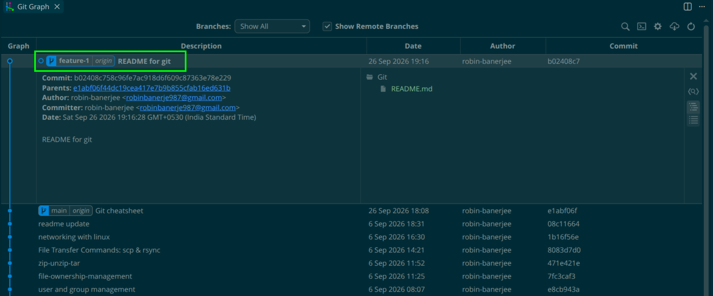
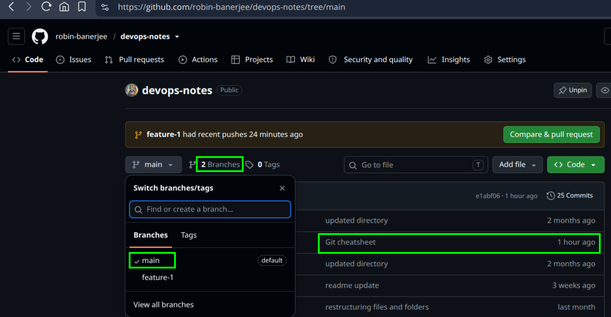
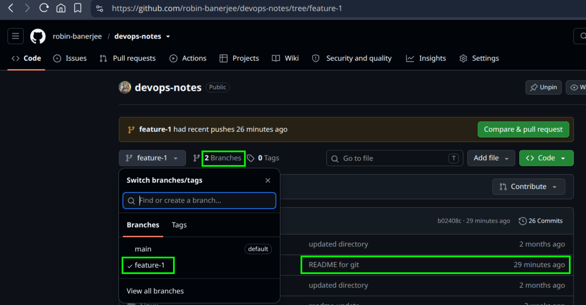
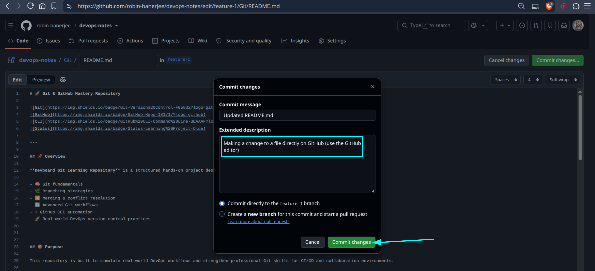
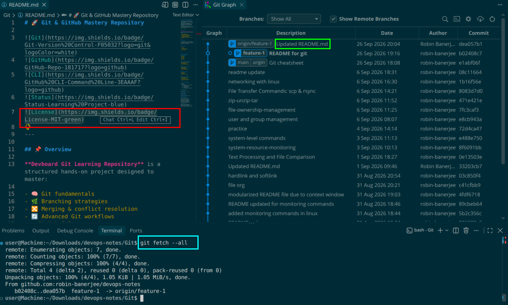
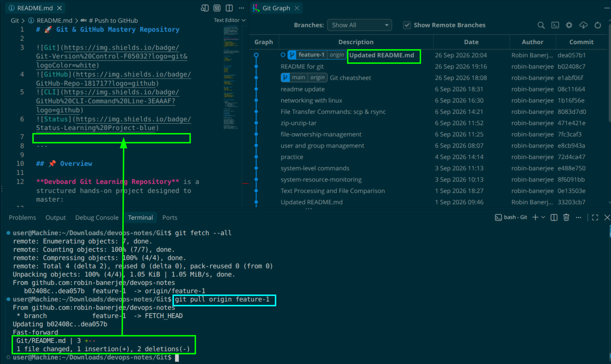
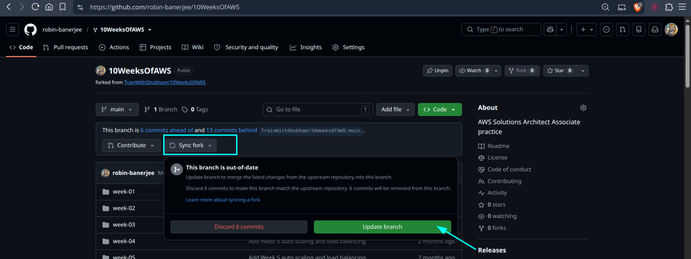

# Day 23 – Git Branching & Working with GitHub

## Task 1: Understanding Branches

### What is a branch in Git? 

A Git branch is a separate line of development that allows developers to work on new features, bug fixes, or experiments independently from the main branch.

### Why do we use branches instead of committing everything to main?

Branches are used for separate development and isolated work. Committing everything directly to the main branch can introduce bugs or unstable changes that may affect the application. Branches help keep the main branch stable and safe.

### What is HEAD in Git?

HEAD is a reference to the latest commit on the currently active branch.

Example:

```text
main
A ← B ← C (HEAD)
```

In this example, `HEAD` points to commit `C`, which is the latest commit on the `main` branch.


### What happens to your files when you switch branches?

When you switch branches, Git changes your working directory to match the selected branch. Uncommitted changes may be carried over or Git may block the switch if conflicts exist. It is a good practice to commit or stash changes before switching branches.

---

## Task 2: Branching Commands — Hands-On

1. List all branches in your repo
2. Create a new branch called `feature-1`
3. Switch to `feature-1`
4. Create a new branch and switch to it in a single command — call it `feature-2`
5. Try using `git switch` to move between branches — how is it different from `git checkout`?
6. Make a commit on `feature-1` that does **not** exist on `main`
7. Switch back to `main` — verify that the commit from `feature-1` is not there
8. Delete a branch you no longer need
9. Add all branching commands to your `git-commands.md`

```bash
raspberry@Pi:~/devops-notes/Git$ git branch
* main
raspberry@Pi:~/devops-notes/Git$ git branch feature-1
raspberry@Pi:~/devops-notes/Git$ git checkout feature-1 
A       Git/README.md
Switched to branch 'feature-1'
raspberry@Pi:~/devops-notes/Git$ git checkout -b feature-2
Switched to a new branch 'feature-2'
raspberry@Pi:~/devops-notes/Git$ git log --oneline
e1abf06 (HEAD -> feature-2, origin/main, main, feature-1) Git cheatsheet
08c1166 readme update
1b16f56 networking with linux
8083d7d File Transfer Commands: scp & rsync
471e421 zip-unzip-tar
7fc3caf file-ownership-management
e8cb943 user and group management

raspberry@Pi:~/devops-notes/Git$ git checkout -b feature-1
fatal: a branch named 'feature-1' already exists
raspberry@Pi:~/devops-notes/Git$ git checkout feature-1
A       Git/README.md
Switched to branch 'feature-1'
raspberry@Pi:~/devops-notes/Git$ git switch feature-2
A       Git/README.md
Switched to branch 'feature-2'
raspberry@Pi:~/devops-notes/Git$ git checkout feature-1
A       Git/README.md
Switched to branch 'feature-1'
raspberry@Pi:~/devops-notes/Git$ git branch
* feature-1
  feature-2
  main
raspberry@Pi:~/devops-notes/Git$ git branch -a
* feature-1
  feature-2
  main
  remotes/origin/main
raspberry@Pi:~/devops-notes/Git$ git branch -r
  origin/main
raspberry@Pi:~/devops-notes/Git$ git add .

raspberry@Pi:~/devops-notes/Git$ git log --oneline
e1abf06 (HEAD -> feature-1, origin/main, main, feature-2) Git cheatsheet
08c1166 readme update
1b16f56 networking with linux
8083d7d File Transfer Commands: scp & rsync
471e421 zip-unzip-tar
7fc3caf file-ownership-management
e8cb943 user and group management

raspberry@Pi:~/devops-notes/Git$ git add .
raspberry@Pi:~/devops-notes/Git$ git commit -m "README for git"
[feature-1 b02408c] README for git
 1 file changed, 126 insertions(+)
 create mode 100644 Git/README.md
raspberry@Pi:~/devops-notes/Git$ git branch 
* feature-1
  feature-2
  main
raspberry@Pi:~/devops-notes/Git$ git switch main 
Switched to branch 'main'
Your branch is up to date with 'origin/main'.

raspberry@Pi:~/devops-notes/Git$ git status 
On branch main
Your branch is up to date with 'origin/main'.

nothing to commit, working tree clean
raspberry@Pi:~/devops-notes/Git$ git branch -d feature-2
Deleted branch feature-2 (was e1abf06).
raspberry@Pi:~/devops-notes/Git$ git checkout feature-1 
Switched to branch 'feature-1'
raspberry@Pi:~/devops-notes/Git$ git status 
On branch feature-1
nothing to commit, working tree clean

raspberry@Pi:~/devops-notes/Git$ git push origin feature-1 
Enumerating objects: 6, done.
Counting objects: 100% (6/6), done.
Delta compression using up to 12 threads
Compressing objects: 100% (4/4), done.
Writing objects: 100% (4/4), 1.52 KiB | 1.52 MiB/s, done.
Total 4 (delta 1), reused 0 (delta 0), pack-reused 0
remote: Resolving deltas: 100% (1/1), completed with 1 local object.
remote: 
remote: Create a pull request for 'feature-1' on GitHub by visiting:
remote:      https://github.com/robin-banerjee/devops-notes/pull/new/feature-1
remote: 
To github.com:robin-banerjee/devops-notes.git
 * [new branch]      feature-1 -> feature-1
```


Listed all branches:

```bash
git branch
```

Created a new branch:

```bash
git branch feature-1
```

Switched to feature-1:

```bash
git checkout feature-1
```

Created and switched in a single command:

```bash
git checkout -b feature-2
```

Using modern Git switch command:

```bash
git switch main
git switch feature-1
```

How is `git switch` different from `git checkout`?
- `git switch` is a newer command introduced to make branch switching simpler and safer. It is specifically used for switching between branches.
- `git checkout` is an older command that has multiple purposes, such as switching branches, restoring files, and checking out specific commits.

Deleted an unused branch:

```bash
git branch -d feature-2
```

---

## Task 3: Push to GitHub

1. Created a **new repository** on GitHub (do NOT initialize it with a README)
2. Connected local `devops-notes` repo to the GitHub remote
3. Pushed `main` branch to GitHub
4. Pushed `feature-1` branch to GitHub
5. Verified both branches are visible on GitHub
6. What is the difference between `origin` and `upstream`?
  * `Origin` -  Points to your remote repository.
  * `Upstream` - Points to the repository you forked from.
    - If not forked then no need of upstream.
  * Origin is the remote repository that you own and push changes to, while upstream is the original repository from which your repository was forked or cloned and from which you receive updates.  

    

 

Added GitHub remote:

```bash
git remote add origin <repository-url>
```

Verified remote:

```bash
git remote -v
```

Pushed main branch:

```bash
git push -u origin main
```

Pushed feature branch:

```bash
git push -u origin feature-1
```

Verified branches on GitHub.

---

## Task 4: Pull from GitHub
1. Make a change to a file **directly on GitHub** (use the GitHub editor)



2. Pull that change to your local repo

```bash
user@Machine:~/Downloads/devops-notes/Git$ git status 
On branch feature-1
nothing to commit, working tree clean
user@Machine:~/Downloads/devops-notes/Git$ git branch 
* feature-1
  main

user@Machine:~/Downloads/devops-notes/Git$ git diff main origin/main
user@Machine:~/Downloads/devops-notes/Git$ git diff main origin/feature-1 
diff --git a/Git/README.md b/Git/README.md
new file mode 100644
index 0000000..ccdfad5
--- /dev/null
+++ b/Git/README.md
@@ -0,0 +1,126 @@
+# 🚀 Git & GitHub Mastery Repository
+
+
+
+
+
+
+
+---
```
 



```bash
user@Machine:~/Downloads/devops-notes/Git$ git fetch --all
remote: Enumerating objects: 7, done.
remote: Counting objects: 100% (7/7), done.
remote: Compressing objects: 100% (4/4), done.
remote: Total 4 (delta 2), reused 0 (delta 0), pack-reused 0 (from 0)
Unpacking objects: 100% (4/4), 1.05 KiB | 1.05 MiB/s, done.
From github.com:robin-banerjee/devops-notes
   b02408c..dea057b  feature-1  -> origin/feature-1

user@Machine:~/Downloads/devops-notes/Git$ git pull origin feature-1 
From github.com:robin-banerjee/devops-notes
 * branch            feature-1  -> FETCH_HEAD
Updating b02408c..dea057b
Fast-forward
 Git/README.md | 3 +--
 1 file changed, 1 insertion(+), 2 deletions(-)

user@Machine:~/Downloads/devops-notes/Git$ git diff main origin/feature-1 
diff --git a/Git/README.md b/Git/README.md
new file mode 100644
index 0000000..e3d15a6
--- /dev/null
+++ b/Git/README.md
@@ -0,0 +1,125 @@
+# 🚀 Git & GitHub Mastery Repository
+
+
+
+
+
+
+---
+
```

3. Answer in your notes: What is the difference between `git fetch` and `git pull`?
 * `fetch` - Only downloads changes from the remote. It does not merge them into your local branch. 
    The fetched commit reference is saved in the FETCH_HEAD file.
 * `pull` - Downloads the changes and merges them into your local branch.
 * git fetch downloads the latest changes from the remote repository without modifying your local branch, while git pull downloads the changes and automatically merges them into your current branch.

---

## Task 5: Clone vs Fork

- Cloned a public repository:

```bash
git clone <repository-url>
```

- Forked a repository on GitHub and cloned the fork locally.

- What is the difference between clone and fork?
    * `Clone` - Clone means copying repository to your local computer. It is connected with remote.
    * `Fork` -  Copying someone else’s repository into your own GitHub account.
   
- When would you clone vs fork?
    * I will fork a repository from publicly available repos into my GitHub account and use it. 
    * I will clone if I want a local copy of a repository. I can work on it freely. 
   
- After forking, how do you keep your fork in sync with the original repo?
    * There is a option avilable on GitHub, SyncFork. You can update a fork using that option.



---

## Key Learnings

* Branches enable safe and isolated development.
* HEAD points to the current branch and commit.
* GitHub remotes allow collaboration and backup.
* git fetch downloads changes without merging.
* git pull downloads and merges changes automatically.
* Forking is useful when contributing to external repositories.
* Cloning creates a local copy of a repository.