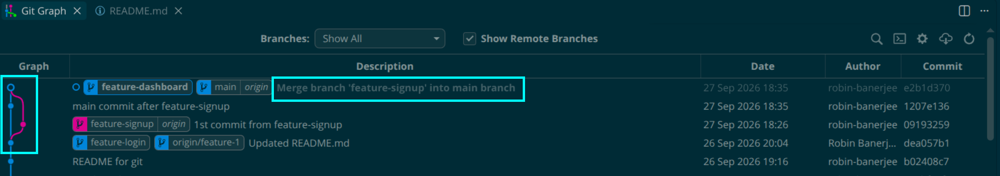
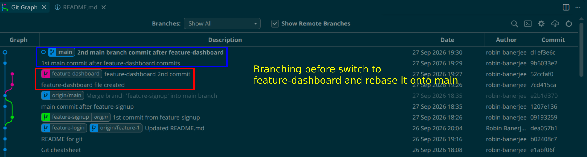
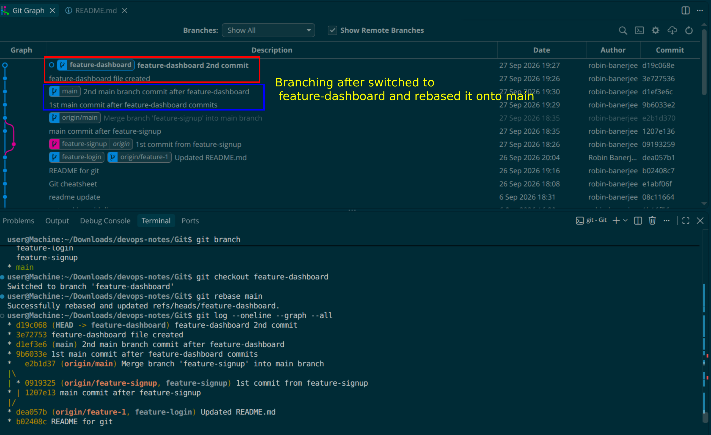
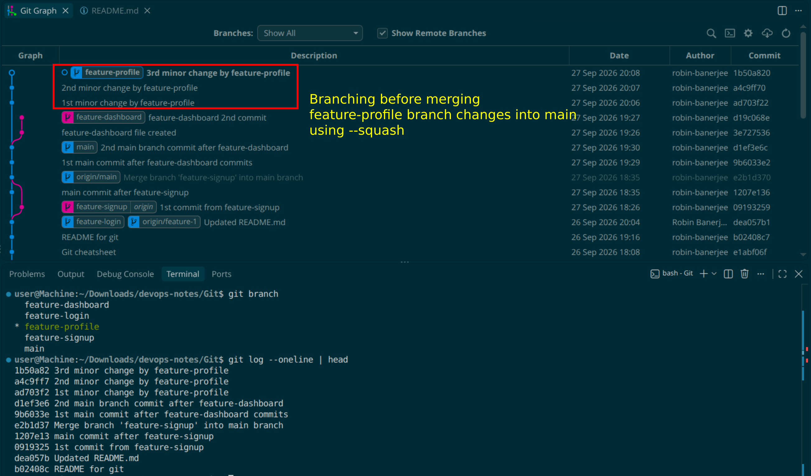
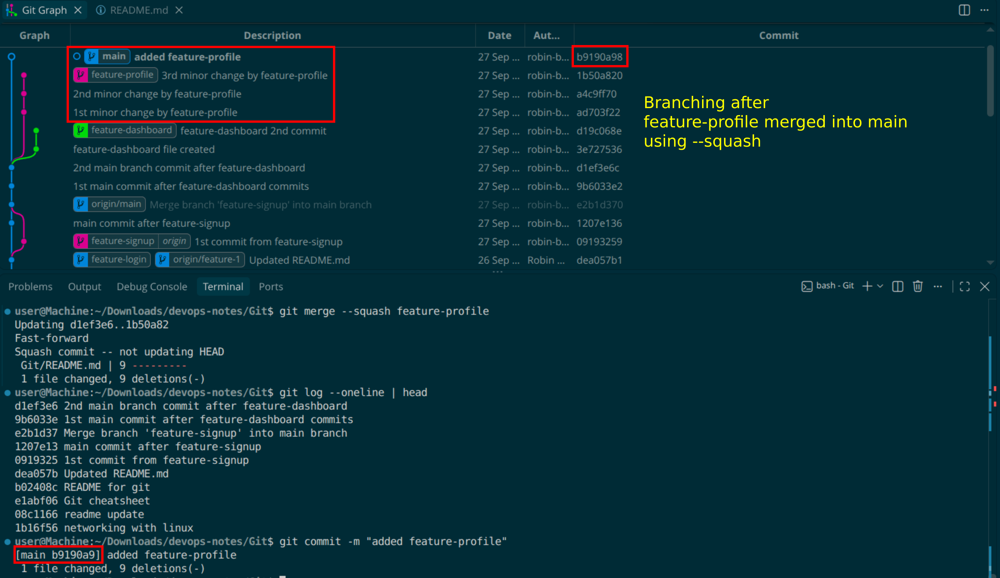
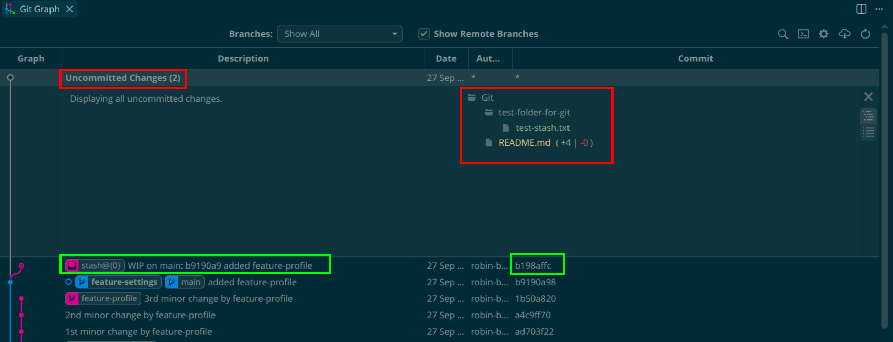
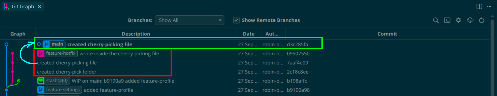

# Day 24 – Advanced Git: Merge, Rebase, Stash & Cherry Pick

## Task 1: Git Merge — Hands-On

1. Create a new branch `feature-login` from `main`, add a couple of commits to it
2. Switch back to `main` and merge `feature-login` into `main`
3. Observe the merge — did Git do a **fast-forward** merge or a **merge commit**?
  * **fast-forward**
```bash
user@Machine:~/Downloads/devops-notes/Git$ git status 
On branch feature-1
nothing to commit, working tree clean
user@Machine:~/Downloads/devops-notes/Git$ git checkout main 
Switched to branch 'main'
Your branch is up to date with 'origin/main'.
user@Machine:~/Downloads/devops-notes/Git$ git status 
On branch main
Your branch is up to date with 'origin/main'.

nothing to commit, working tree clean
user@Machine:~/Downloads/devops-notes/Git$ git checkout feature-1 
Switched to branch 'feature-1'
user@Machine:~/Downloads/devops-notes/Git$ git branch
* feature-1
  main
# Renaming the feature-1 branch to feature-login
user@Machine:~/Downloads/devops-notes/Git$ git branch -m "feature-login"
user@Machine:~/Downloads/devops-notes/Git$ git branch
* feature-login
  main
# Before merging always switch to the branch you want to merge into
user@Machine:~/Downloads/devops-notes/Git$ git switch main 
Switched to branch 'main'
Your branch is up to date with 'origin/main'.
user@Machine:~/Downloads/devops-notes/Git$ git branch
  feature-login
* main

user@Machine:~/Downloads/devops-notes/Git$ git merge feature-login 
Updating e1abf06..dea057b
Fast-forward
 Git/README.md | 125 +++++++++++++++++++++++++++++++++++++++++++++++++++++++++++++++++++++++++++++++++++++++++++++++++++++++++++++++++++++++++++++
 1 file changed, 125 insertions(+)
 create mode 100644 Git/README.md
```
     
4. Now create another branch `feature-signup`, add commits to it — but also add a commit to `main` before merging
5. Merge `feature-signup` into `main` — what happens this time?
 * **merge commit**
 
```bash
user@Machine:~/Downloads/devops-notes/Git$ git status 
On branch main
Your branch is ahead of 'origin/main' by 2 commits.
  (use "git push" to publish your local commits)

nothing to commit, working tree clean
user@Machine:~/Downloads/devops-notes/Git$ git add .
user@Machine:~/Downloads/devops-notes/Git$ git checkout -b feature-signup
Switched to a new branch 'feature-signup'
user@Machine:~/Downloads/devops-notes/Git$ git status 
On branch feature-signup
Changes not staged for commit:
  (use "git add <file>..." to update what will be committed)
  (use "git restore <file>..." to discard changes in working directory)
        modified:   README.md

no changes added to commit (use "git add" and/or "git commit -a")
user@Machine:~/Downloads/devops-notes/Git$ git add .
user@Machine:~/Downloads/devops-notes/Git$ git commit -m "1st commit from feature-signup"
[feature-signup 0919325] 1st commit from feature-signup
 1 file changed, 1 deletion(-)
user@Machine:~/Downloads/devops-notes/Git$ git push origin feature-signup 
Enumerating objects: 7, done.
Counting objects: 100% (7/7), done.
Delta compression using up to 12 threads
Compressing objects: 100% (4/4), done.
Writing objects: 100% (4/4), 388 bytes | 388.00 KiB/s, done.
Total 4 (delta 2), reused 0 (delta 0), pack-reused 0
remote: Resolving deltas: 100% (2/2), completed with 2 local objects.
remote: 
remote: Create a pull request for 'feature-signup' on GitHub by visiting:
remote:      https://github.com/robin-banerjee/devops-notes/pull/new/feature-signup
remote: 
To github.com:robin-banerjee/devops-notes.git
 * [new branch]      feature-signup -> feature-signup
user@Machine:~/Downloads/devops-notes/Git$ git branch 
  feature-login
* feature-signup
  main

user@Machine:~/Downloads/devops-notes/Git$ git switch main
Switched to branch 'main'
Your branch is ahead of 'origin/main' by 2 commits.
  (use "git push" to publish your local commits)
user@Machine:~/Downloads/devops-notes/Git$ git status 
On branch main
Your branch is ahead of 'origin/main' by 2 commits.
  (use "git push" to publish your local commits)

nothing to commit, working tree clean
user@Machine:~/Downloads/devops-notes/Git$ git push origin main 
Total 0 (delta 0), reused 0 (delta 0), pack-reused 0
To github.com:robin-banerjee/devops-notes.git
   e1abf06..dea057b  main -> main
user@Machine:~/Downloads/devops-notes/Git$ git log --oneline | head -5
dea057b Updated README.md
b02408c README for git
e1abf06 Git cheatsheet
08c1166 readme update
1b16f56 networking with linux
user@Machine:~/Downloads/devops-notes/Git$ git branch
  feature-login
  feature-signup
* main

user@Machine:~/Downloads/devops-notes/Git$ git add .
user@Machine:~/Downloads/devops-notes/Git$ git commit -m "main commit after feature-signup"
[main 1207e13] main commit after feature-signup
 1 file changed, 1 insertion(+), 1 deletion(-)
user@Machine:~/Downloads/devops-notes/Git$ git push origin main 
Enumerating objects: 7, done.
Counting objects: 100% (7/7), done.
Delta compression using up to 12 threads
Compressing objects: 100% (4/4), done.
Writing objects: 100% (4/4), 400 bytes | 400.00 KiB/s, done.
Total 4 (delta 2), reused 0 (delta 0), pack-reused 0
remote: Resolving deltas: 100% (2/2), completed with 2 local objects.
To github.com:robin-banerjee/devops-notes.git
   dea057b..1207e13  main -> main

user@Machine:~/Downloads/devops-notes/Git$ git merge feature-signup 
Auto-merging Git/README.md
Merge made by the 'ort' strategy.
 Git/README.md | 1 -
 1 file changed, 1 deletion(-)

user@Machine:~/Downloads/devops-notes/Git$ git log --oneline | head -5
e2b1d37 Merge branch 'feature-signup' into main branch
1207e13 main commit after feature-signup
0919325 1st commit from feature-signup
dea057b Updated README.md
b02408c README for git
user@Machine:~/Downloads/devops-notes/Git$ git status 
On branch main
Your branch is ahead of 'origin/main' by 2 commits.
  (use "git push" to publish your local commits)

nothing to commit, working tree clean
```



```
Observations
- Fast-forward merge happens when there is a linear path between branches.
- Merge commit is created when branches diverge and both have separate commits.
- The merge of feature-login into master was a three-way merge because both branches had diverged. Git created a merge commit (e2b1d37) using the ort merge strategy.
``` 

## Fast-Forward Merge vs Three-Way Merge

| Fast-Forward Merge | Three-Way Merge |
|-------------------|-----------------|
| No merge commit is created. | A merge commit is created. |
| Happens when the target branch has not changed since the feature branch was created. | Happens when both branches have new commits. |
| Git simply moves the branch pointer forward. | Git combines two separate histories. |
| Maintains a linear commit history. | Preserves branch history. |

### Fast-Forward Merge

Before merge:

```text
A---B---C (main)
         \
          D---E (feature-login)
```

```bash
git checkout main
git merge feature-login
```

After merge:

```text
A---B---C---D---E (main)
```

### Three-Way Merge

Before merge:

```text
A---B---C---F (main)
         \
          D---E (feature-login)
```

```bash
git checkout main
git merge feature-login
```

After merge:

```text
A---B---C---F------M (main)
         \        /
          D------E
```

`M` is the merge commit created by Git.

Output:

```bash
Merge made by the 'ort' strategy.
```

### Example from This Repository

The merge of `feature-login` into `main` was a **three-way merge** because both branches contained new commits. Git created a merge commit to combine the histories

6. Answer in your notes:
  - What is a fast-forward merge?
     * It merges two branches without creating a new commit. Instead, it simply moves the current branch’s 
       pointer forward to match the branch being merged. 
  - When does Git create a merge commit instead?
     * When you try to merge two branches that have diverged. Git makes a new commit to combine the incoming changes.
  - What is a merge conflict? (try creating one intentionally by editing the same line in both branches)
     * A merge conflict occurs when the same part of a file is changed in two branches. 
       When merging, Git cannot automatically  decide which change to keep. 
       Git will pause and require you to resolve the conflict before completing the merge.
---

## Task 2: Git Rebase — Hands-On

1. Create a branch `feature-dashboard` from `main`, add 2-3 commits
2. While on `main`, add a new commit (so `main` moves ahead)



3. Switch to `feature-dashboard` and rebase it onto `main`
4. Observe your `git log --oneline --graph --all` — how does the history look compared to a merge?



```bash
user@Machine:~/Downloads/devops-notes/Git$ git checkout -b feature-dashboard
Switched to a new branch 'feature-dashboard'
user@Machine:~/Downloads/devops-notes/Git$ git branch 
* feature-dashboard
  feature-login
  feature-signup
  main
user@Machine:~/Downloads/devops-notes/Git$ git status
On branch feature-dashboard
nothing to commit, working tree clean

user@Machine:~/Downloads/devops-notes/Git$ echo "this file was created with feature-dashboard" > feature-dashboard-file.txt
user@Machine:~/Downloads/devops-notes/Git$ echo "this line was appended with feature-dashboard" >> feature-dashboard-file.txt
user@Machine:~/Downloads/devops-notes/Git$ git add .
user@Machine:~/Downloads/devops-notes/Git$ git commit -m "feature-dashboard file created"
[feature-dashboard 7cd415c] feature-dashboard file created
 1 file changed, 2 insertions(+)
 create mode 100644 Git/feature-dashboard-file.txt
user@Machine:~/Downloads/devops-notes/Git$ echo "some more commit lines from feature-dashboard" >> feature-dashboard-file.txt
user@Machine:~/Downloads/devops-notes/Git$ git commit -m "feature-dashboard 2nd commit"
On branch feature-dashboard
Changes not staged for commit:
  (use "git add <file>..." to update what will be committed)
  (use "git restore <file>..." to discard changes in working directory)
        modified:   feature-dashboard-file.txt

no changes added to commit (use "git add" and/or "git commit -a")
user@Machine:~/Downloads/devops-notes/Git$ git add .
user@Machine:~/Downloads/devops-notes/Git$ git commit -m "feature-dashboard 2nd commit"
[feature-dashboard 52ccfaf] feature-dashboard 2nd commit
 1 file changed, 1 insertion(+)
user@Machine:~/Downloads/devops-notes/Git$ git status 
On branch feature-dashboard
nothing to commit, working tree clean

user@Machine:~/Downloads/devops-notes/Git$ git log --oneline 
52ccfaf (HEAD -> feature-dashboard) feature-dashboard 2nd commit
7cd415c feature-dashboard file created
e2b1d37 (origin/main, main) Merge branch 'feature-signup' into main branch
1207e13 main commit after feature-signup
0919325 (origin/feature-signup, feature-signup) 1st commit from feature-signup
dea057b (origin/feature-1, feature-login) Updated README.md
b02408c README for git
e1abf06 Git cheatsheet
```
```bash
user@Machine:~/Downloads/devops-notes/Git$ git switch main 
Switched to branch 'main'
Your branch is up to date with 'origin/main'.
user@Machine:~/Downloads/devops-notes/Git$ git add .
user@Machine:~/Downloads/devops-notes/Git$ git commit -m "1st main commit after feature-dashboard commits"
[main 9b6033e] 1st main commit after feature-dashboard commits
 1 file changed, 1 insertion(+), 1 deletion(-)
user@Machine:~/Downloads/devops-notes/Git$ git add .
user@Machine:~/Downloads/devops-notes/Git$ git commit -m "2nd main branch commit after feature-dashboard"
[main d1ef3e6] 2nd main branch commit after feature-dashboard
 1 file changed, 4 deletions(-)
user@Machine:~/Downloads/devops-notes/Git$ git status
On branch main
Your branch is ahead of 'origin/main' by 2 commits.
  (use "git push" to publish your local commits)
nothing to commit, working tree clean

user@Machine:~/Downloads/devops-notes/Git$ git log --oneline | head -5
d1ef3e6 2nd main branch commit after feature-dashboard
9b6033e 1st main commit after feature-dashboard commits
e2b1d37 Merge branch 'feature-signup' into main branch
1207e13 main commit after feature-signup
0919325 1st commit from feature-signup
user@Machine:~/Downloads/devops-notes/Git$ git branch
  feature-dashboard
  feature-login
  feature-signup
* main
```
```bash
user@Machine:~/Downloads/devops-notes/Git$ git checkout feature-dashboard 
Switched to branch 'feature-dashboard'
user@Machine:~/Downloads/devops-notes/Git$ git rebase main 
Successfully rebased and updated refs/heads/feature-dashboard.
user@Machine:~/Downloads/devops-notes/Git$ git log --oneline --graph --all
* d19c068 (HEAD -> feature-dashboard) feature-dashboard 2nd commit
* 3e72753 feature-dashboard file created
* d1ef3e6 (main) 2nd main branch commit after feature-dashboard
* 9b6033e 1st main commit after feature-dashboard commits
*   e2b1d37 (origin/main) Merge branch 'feature-signup' into main branch
|\  
| * 0919325 (origin/feature-signup, feature-signup) 1st commit from feature-signup
* | 1207e13 main commit after feature-signup
|/  
* dea057b (origin/feature-1, feature-login) Updated README.md
* b02408c README for git
* e1abf06 Git cheatsheet
```
    
5. Answer in your notes:
   - What does rebase actually do to your commits?
     * Rebase creates linear history. It moves commits from one branch and applies them onto another base commit.

   - How is the history different from a merge?
     * Merge doesn’t change history, it shows commits as they were. What rebase did is it changed history of commits, 
       it showed main commit first then the `feature-dashboard` commit to make it linear.
       It is as if I started `feature-dashboard` from newest `main` commit.

   - Why should you **never rebase commits that have been pushed and shared** with others?
     * Because rebase rewrites commit history. If others have already pulled those commits,
       then it will create confusion and conflicts.

   - When would you use rebase vs merge?
        * Rebase: clean linear history (local work)  
        * Merge: team collaboration safe history

---

## Task 3: Squash Commit vs Merge Commit

1. Create a branch `feature-profile`, add 4-5 small commits (typo fix, formatting, etc.)



```bash
user@Machine:~/Downloads/devops-notes/Git$ git switch main
Switched to branch 'main'
Your branch is ahead of 'origin/main' by 2 commits.
  (use "git push" to publish your local commits)
user@Machine:~/Downloads/devops-notes/Git$ git checkout -b feature-profile
Switched to a new branch 'feature-profile'
user@Machine:~/Downloads/devops-notes/Git$ git status 
On branch feature-profile
Changes not staged for commit:
  (use "git add <file>..." to update what will be committed)
  (use "git restore <file>..." to discard changes in working directory)
        modified:   README.md

no changes added to commit (use "git add" and/or "git commit -a")

user@Machine:~/Downloads/devops-notes/Git$ git add .
user@Machine:~/Downloads/devops-notes/Git$ git commit -m "1st minor change by feature-profile"
[feature-profile ad703f2] 1st minor change by feature-profile
 1 file changed, 2 deletions(-)
user@Machine:~/Downloads/devops-notes/Git$ git status 
On branch feature-profile
Changes not staged for commit:
  (use "git add <file>..." to update what will be committed)
  (use "git restore <file>..." to discard changes in working directory)
        modified:   README.md

no changes added to commit (use "git add" and/or "git commit -a")
user@Machine:~/Downloads/devops-notes/Git$ git add .
user@Machine:~/Downloads/devops-notes/Git$ git commit -m "2nd minor change by feature-profile"
[feature-profile a4c9ff7] 2nd minor change by feature-profile
 1 file changed, 2 deletions(-)
user@Machine:~/Downloads/devops-notes/Git$ git status 
On branch feature-profile
Changes not staged for commit:
  (use "git add <file>..." to update what will be committed)
  (use "git restore <file>..." to discard changes in working directory)
        modified:   README.md

no changes added to commit (use "git add" and/or "git commit -a")
user@Machine:~/Downloads/devops-notes/Git$ git add .
user@Machine:~/Downloads/devops-notes/Git$ git commit -m "3rd minor change by feature-profile"
[feature-profile 1b50a82] 3rd minor change by feature-profile
 1 file changed, 5 deletions(-)

user@Machine:~/Downloads/devops-notes/Git$ git branch 
  feature-dashboard
  feature-login
* feature-profile
  feature-signup
  main
user@Machine:~/Downloads/devops-notes/Git$ git log --oneline | head 
1b50a82 3rd minor change by feature-profile
a4c9ff7 2nd minor change by feature-profile
ad703f2 1st minor change by feature-profile
d1ef3e6 2nd main branch commit after feature-dashboard
9b6033e 1st main commit after feature-dashboard commits
e2b1d37 Merge branch 'feature-signup' into main branch
1207e13 main commit after feature-signup
0919325 1st commit from feature-signup
dea057b Updated README.md
b02408c README for git
```
```bash
user@Machine:~/Downloads/devops-notes/Git$ git checkout main 
Switched to branch 'main'
Your branch is ahead of 'origin/main' by 2 commits.
  (use "git push" to publish your local commits)
user@Machine:~/Downloads/devops-notes/Git$ git branch 
  feature-dashboard
  feature-login
  feature-profile
  feature-signup
* main
user@Machine:~/Downloads/devops-notes/Git$ git log --oneline | head
d1ef3e6 2nd main branch commit after feature-dashboard
9b6033e 1st main commit after feature-dashboard commits
e2b1d37 Merge branch 'feature-signup' into main branch
1207e13 main commit after feature-signup
0919325 1st commit from feature-signup
dea057b Updated README.md
b02408c README for git
e1abf06 Git cheatsheet
08c1166 readme update
1b16f56 networking with linux

user@Machine:~/Downloads/devops-notes/Git$ git merge --squash feature-profile
Updating d1ef3e6..1b50a82
Fast-forward
Squash commit -- not updating HEAD
 Git/README.md | 9 ---------
 1 file changed, 9 deletions(-)

user@Machine:~/Downloads/devops-notes/Git$ git log --oneline | head
d1ef3e6 2nd main branch commit after feature-dashboard
9b6033e 1st main commit after feature-dashboard commits
e2b1d37 Merge branch 'feature-signup' into main branch
1207e13 main commit after feature-signup
0919325 1st commit from feature-signup
dea057b Updated README.md
b02408c README for git
e1abf06 Git cheatsheet
08c1166 readme update
1b16f56 networking with linux

user@Machine:~/Downloads/devops-notes/Git$ git commit -m "added feature-profile"
[main b9190a9] added feature-profile
 1 file changed, 9 deletions(-)
```

2. Merge it into `main` using `--squash` — what happens?


    
3. Check `git log` — how many commits were added to `main`?
    - Checked `git log` and observed that only one commit was added to `main`.

```bash
user@Machine:~/Downloads/devops-notes/Git$ git log --oneline | head
b9190a9 added feature-profile
d1ef3e6 2nd main branch commit after feature-dashboard
9b6033e 1st main commit after feature-dashboard commits
e2b1d37 Merge branch 'feature-signup' into main branch
1207e13 main commit after feature-signup
0919325 1st commit from feature-signup
dea057b Updated README.md
b02408c README for git
e1abf06 Git cheatsheet
08c1166 readme update
```

4. Now create another branch `feature-settings`, add a few commits
5. Merge it into `main` **without** `--squash` (regular merge) — compare the history

- Now created another branch feature-settings, added a few commits
- Merged it into `main` without using squash (regular merge) and compared the commit history.
- Observation:
    * Unlike a squash merge, all commits from the feature-settings branch were preserved in the master branch history. No commits were combined, and each commit remained visible in the commit log.
    
6. Answer in your notes:
   - What does squash merging do?
     * It combines multiple commits from a branch and merges them into another branch as a single commit.
   - When would you use squash merge vs regular merge?
     * If one file has multiple commits, then squashing is better. Else regular merge.
   - What is the trade-off of squashing?
     * Detailed commit history is lost from feature branch as only one commit will be shown in main branch.

---

## Task 4: Git Stash — Hands-On

1. Start making changes to a file but **do not commit**
2. Now imagine you need to urgently switch to another branch — try switching. What happens?
    * If changes doesn't conflict with the branch you are switching to it will let you switch, else it will not allow switch.
```bash
user@Machine:~/Downloads/devops-notes/Git$ git checkout -b feature-settings
Switched to a new branch 'feature-settings'
user@Machine:~/Downloads/devops-notes/Git$ mkdir -p test-folder-for-git
user@Machine:~/Downloads/devops-notes/Git$ cd test-folder-for-git/
user@Machine:~/Downloads/devops-notes/Git/test-folder-for-git$ git add .

user@Machine:~/Downloads/devops-notes/Git/test-folder-for-git$ touch test-stash.txt
user@Machine:~/Downloads/devops-notes/Git/test-folder-for-git$ echo "for testing git stash"> test-stash.txt 
user@Machine:~/Downloads/devops-notes/Git/test-folder-for-git$ git add .

user@Machine:~/Downloads/devops-notes/Git/test-folder-for-git$ git switch main 
A       Git/test-folder-for-git/test-stash.txt
Switched to branch 'main'
Your branch is ahead of 'origin/main' by 3 commits.
  (use "git push" to publish your local commits)
```
    
    
3. Use `git stash` to save your work-in-progress
4. Switch to another branch, do some work, switch back
5. Apply your stashed changes using `git stash pop`
6. Try stashing multiple times and list all stashes
7. Try applying a specific stash from the list

```bash
user@Machine:~/Downloads/devops-notes/Git$ git checkout -b feature-settings
Switched to a new branch 'feature-settings'
user@Machine:~/Downloads/devops-notes/Git$ mkdir -p test-folder-for-git
user@Machine:~/Downloads/devops-notes/Git$ cd test-folder-for-git/
user@Machine:~/Downloads/devops-notes/Git/test-folder-for-git$ git add .
user@Machine:~/Downloads/devops-notes/Git/test-folder-for-git$ touch test-stash.txt
user@Machine:~/Downloads/devops-notes/Git/test-folder-for-git$ echo "for testing git stash"> test-stash.txt 
user@Machine:~/Downloads/devops-notes/Git/test-folder-for-git$ git add .
  
user@Machine:~/Downloads/devops-notes/Git/test-folder-for-git$ git status 
On branch feature-settings
Changes to be committed:
  (use "git restore --staged <file>..." to unstage)
        new file:   test-stash.txt

user@Machine:~/Downloads/devops-notes/Git/test-folder-for-git$ git switch main 
A       Git/test-folder-for-git/test-stash.txt
Switched to branch 'main'
Your branch is ahead of 'origin/main' by 3 commits.
  (use "git push" to publish your local commits)
user@Machine:~/Downloads/devops-notes/Git/test-folder-for-git$ ls
test-stash.txt

user@Machine:~/Downloads/devops-notes/Git/test-folder-for-git$ echo "this line is from main branch">> test-stash.txt 
user@Machine:~/Downloads/devops-notes/Git/test-folder-for-git$ git add .
user@Machine:~/Downloads/devops-notes/Git/test-folder-for-git$ git checkout feature-settings 
A       Git/test-folder-for-git/test-stash.txt
Switched to branch 'feature-settings'
user@Machine:~/Downloads/devops-notes/Git/test-folder-for-git$ git status
On branch feature-settings
Changes to be committed:
  (use "git restore --staged <file>..." to unstage)
        new file:   test-stash.txt

user@Machine:~/Downloads/devops-notes/Git/test-folder-for-git$ git stash
Saved working directory and index state WIP on feature-settings: b9190a9 added feature-profile
user@Machine:~/Downloads/devops-notes/Git/test-folder-for-git$ git stash list 
fatal: Unable to read current working directory: No such file or directory
user@Machine:~/Downloads/devops-notes/Git/test-folder-for-git$ cd ..
user@Machine:~/Downloads/devops-notes/Git$ git stash list 
stash@{0}: WIP on feature-settings: b9190a9 added feature-profile

user@Machine:~/Downloads/devops-notes/Git$ echo "this is another line from feature-settings" >> test-folder-for-git/test-stash.txt
bash: test-folder-for-git/test-stash.txt: No such file or directory
user@Machine:~/Downloads/devops-notes/Git$ git stash pop
On branch feature-settings
Changes to be committed:
  (use "git restore --staged <file>..." to unstage)
        new file:   test-folder-for-git/test-stash.txt
Dropped refs/stash@{0} (7f3d4e246cab038138d517033c67b17aa9c03da5)

user@Machine:~/Downloads/devops-notes/Git$ git stash list 
user@Machine:~/Downloads/devops-notes/Git$ ^C
```
```bash
user@Machine:~/Downloads/devops-notes/Git$ echo "this is another line from feature-settings" >> test-folder-for-git/test-stash.txt
bash: test-folder-for-git/test-stash.txt: No such file or directory
user@Machine:~/Downloads/devops-notes/Git$ git stash pop
On branch feature-settings
Changes to be committed:
  (use "git restore --staged <file>..." to unstage)
        new file:   test-folder-for-git/test-stash.txt

Dropped refs/stash@{0} (7f3d4e246cab038138d517033c67b17aa9c03da5)
user@Machine:~/Downloads/devops-notes/Git$ git stash list 
user@Machine:~/Downloads/devops-notes/Git$ ^C
user@Machine:~/Downloads/devops-notes/Git$ cat test-folder-for-git/test-stash.txt 
for testing git stash
this line is from main branch
user@Machine:~/Downloads/devops-notes/Git$ git branch 
  feature-dashboard
  feature-login
  feature-profile
* feature-settings
  feature-signup
  main
user@Machine:~/Downloads/devops-notes/Git$ git checkout main 
A       Git/test-folder-for-git/test-stash.txt
Switched to branch 'main'
Your branch is ahead of 'origin/main' by 3 commits.
  (use "git push" to publish your local commits)
user@Machine:~/Downloads/devops-notes/Git$ git stash list 
user@Machine:~/Downloads/devops-notes/Git$ git status 
On branch main
Your branch is ahead of 'origin/main' by 3 commits.
  (use "git push" to publish your local commits)

Changes to be committed:
  (use "git restore --staged <file>..." to unstage)
        new file:   test-folder-for-git/test-stash.txt

user@Machine:~/Downloads/devops-notes/Git$ echo "this is 2nd line from main" >> test-folder-for-git/test-stash.txt 
user@Machine:~/Downloads/devops-notes/Git$ git add .
user@Machine:~/Downloads/devops-notes/Git$ git stash
Saved working directory and index state WIP on main: b9190a9 added feature-profile
user@Machine:~/Downloads/devops-notes/Git$ echo "this is 3rd line from main" >> test-folder-for-git/test-stash.txt 
bash: test-folder-for-git/test-stash.txt: No such file or directory
user@Machine:~/Downloads/devops-notes/Git$ git stash list
stash@{0}: WIP on main: b9190a9 added feature-profile

user@Machine:~/Downloads/devops-notes/Git$ git checkout feature-settings 
Switched to branch 'feature-settings'
user@Machine:~/Downloads/devops-notes/Git$ echo "this is 3rd line from feature-settings" >> test-folder-for-git/test-stash.txt 
bash: test-folder-for-git/test-stash.txt: No such file or directory
user@Machine:~/Downloads/devops-notes/Git$ git branch 
  feature-dashboard
  feature-login
  feature-profile
* feature-settings
  feature-signup
  main
user@Machine:~/Downloads/devops-notes/Git$ git status 
On branch feature-settings
Changes not staged for commit:
  (use "git add <file>..." to update what will be committed)
  (use "git restore <file>..." to discard changes in working directory)
        modified:   README.md

no changes added to commit (use "git add" and/or "git commit -a")
user@Machine:~/Downloads/devops-notes/Git$ git add .

user@Machine:~/Downloads/devops-notes/Git$ git stash 
Saved working directory and index state WIP on feature-settings: b9190a9 added feature-profile
user@Machine:~/Downloads/devops-notes/Git$ git stash list
stash@{0}: WIP on feature-settings: b9190a9 added feature-profile
stash@{1}: WIP on main: b9190a9 added feature-profile
user@Machine:~/Downloads/devops-notes/Git$ git stash pop stash@{0} 
On branch feature-settings
Changes not staged for commit:
  (use "git add <file>..." to update what will be committed)
  (use "git restore <file>..." to discard changes in working directory)
        modified:   README.md

no changes added to commit (use "git add" and/or "git commit -a")
Dropped stash@{0} (3841500db2e2b9acd94d19e88fdaf31377c43905)
user@Machine:~/Downloads/devops-notes/Git$ git stash list 
stash@{0}: WIP on main: b9190a9 added feature-profile

user@Machine:~/Downloads/devops-notes/Git$ git stash apply stash@{0} 
On branch feature-settings
Changes to be committed:
  (use "git restore --staged <file>..." to unstage)
        new file:   test-folder-for-git/test-stash.txt
Changes not staged for commit:
  (use "git add <file>..." to update what will be committed)
  (use "git restore <file>..." to discard changes in working directory)
        modified:   README.md

user@Machine:~/Downloads/devops-notes/Git$ git stash list 
stash@{0}: WIP on main: b9190a9 added feature-profile
```


8. Answer in your notes:
   - What is the difference between `git stash pop` and `git stash apply`?
     * `git stash pop` applies stash changes to your working directory and deletes the stash entry.
     * `git stash apply` applies stash changes to your working directory but keeps the stash entry.
   - When would you use stash in a real-world workflow?
        * When an urgent fix comes up, I would stash changes from my current branch and switch to another branch 
       to work on urgent fix first.
        * Used when switching context quickly without committing incomplete work.

---

## Task 5: Cherry Picking

1. Create a branch `feature-hotfix`, make 3 commits with different changes
2. Switch to `main`
3. Cherry-pick **only the second commit** from `feature-hotfix` onto `main` 
4. Verify with `git log` that only that one commit was applied

```bash
user@Machine:~/Downloads/devops-notes/Git$ git checkout -b feature-hotfix
Switched to a new branch 'feature-hotfix'
user@Machine:~/Downloads/devops-notes/Git$ mkdir -p cherry-pick
user@Machine:~/Downloads/devops-notes/Git$ git add .
user@Machine:~/Downloads/devops-notes/Git$ git commit -m "created cherry-pick folder"
[feature-hotfix 2c18c8e] created cherry-pick folder
 2 files changed, 7 insertions(+)
 create mode 100644 Git/test-folder-for-git/test-stash.txt
user@Machine:~/Downloads/devops-notes/Git$ cd cherry-pick/
user@Machine:~/Downloads/devops-notes/Git/cherry-pick$ touch test-cherry-picking.txt
user@Machine:~/Downloads/devops-notes/Git/cherry-pick$ git add .
user@Machine:~/Downloads/devops-notes/Git/cherry-pick$ git commit -m "created cherry-picking file"
[feature-hotfix 7aaf4e0] created cherry-picking file
 1 file changed, 0 insertions(+), 0 deletions(-)
 create mode 100644 Git/cherry-pick/test-cherry-picking.txt
user@Machine:~/Downloads/devops-notes/Git/cherry-pick$ echo "this file is for testing cherry pick commits" > test-cherry-picking.txt 
user@Machine:~/Downloads/devops-notes/Git/cherry-pick$ git add .
user@Machine:~/Downloads/devops-notes/Git/cherry-pick$ git commit -m "wrote inside the cherry-picking file"
[feature-hotfix 0950755] wrote inside the cherry-picking file
 1 file changed, 1 insertion(+)
user@Machine:~/Downloads/devops-notes/Git/cherry-pick$ git status 
On branch feature-hotfix
nothing to commit, working tree clean

user@Machine:~/Downloads/devops-notes/Git/cherry-pick$ git log --oneline | head
0950755 wrote inside the cherry-picking file
7aaf4e0 created cherry-picking file
2c18c8e created cherry-pick folder
b9190a9 added feature-profile
d1ef3e6 2nd main branch commit after feature-dashboard
9b6033e 1st main commit after feature-dashboard commits
e2b1d37 Merge branch 'feature-signup' into main branch
1207e13 main commit after feature-signup
0919325 1st commit from feature-signup
dea057b Updated README.md

user@Machine:~/Downloads/devops-notes/Git/cherry-pick$ git checkout main 
Switched to branch 'main'
Your branch is ahead of 'origin/main' by 3 commits.
  (use "git push" to publish your local commits)

user@Machine:~/Downloads/devops-notes/Git/cherry-pick$ git log --oneline | head
b9190a9 added feature-profile
d1ef3e6 2nd main branch commit after feature-dashboard
9b6033e 1st main commit after feature-dashboard commits
e2b1d37 Merge branch 'feature-signup' into main branch
1207e13 main commit after feature-signup
0919325 1st commit from feature-signup
dea057b Updated README.md
b02408c README for git
e1abf06 Git cheatsheet
08c1166 readme update
user@Machine:~/Downloads/devops-notes/Git/cherry-pick$ cd ..

user@Machine:~/Downloads/devops-notes/Git$ git cherry-pick 7aaf4e0
[main d3c285f] created cherry-picking file
 Date: Sun Sep 27 22:01:09 2026 +0530
 1 file changed, 0 insertions(+), 0 deletions(-)
 create mode 100644 Git/cherry-pick/test-cherry-picking.txt
user@Machine:~/Downloads/devops-notes/Git$ git log --oneline | head
d3c285f created cherry-picking file
b9190a9 added feature-profile
d1ef3e6 2nd main branch commit after feature-dashboard
9b6033e 1st main commit after feature-dashboard commits
e2b1d37 Merge branch 'feature-signup' into main branch
1207e13 main commit after feature-signup
0919325 1st commit from feature-signup
dea057b Updated README.md
b02408c README for git
e1abf06 Git cheatsheet
```


5. Answer in your notes:
   - What does cherry-pick do?
        * It lets you pick and apply one/range commit from another branch to your current branch instead of merging all.
   - When would you use cherry-pick in a real project?
        * Suppose I made 3 changes but I want only one change to be applied to main branch. Then I would cherry-pick that single commit instead of merging the whole branch.
   - What can go wrong with cherry-picking?
        * If the same branch is merged then it will create duplicate commits.
        * It may create conflicts if the commit depends on previous commits.

---

## Summary
- Learned how Git manages history
- Understood clean vs messy workflows
- Practiced real-world DevOps branching strategies

---

## Commands Practiced
- git merge
- git rebase
- git stash / stash pop / stash apply
- git cherry-pick
- git log --oneline --graph --all
- git squash merge