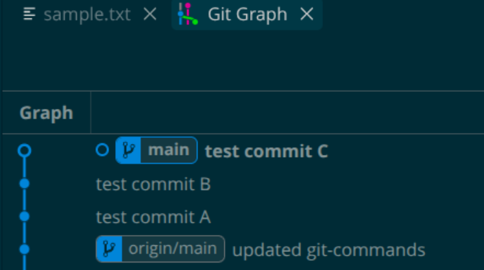
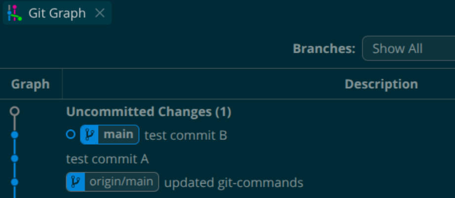
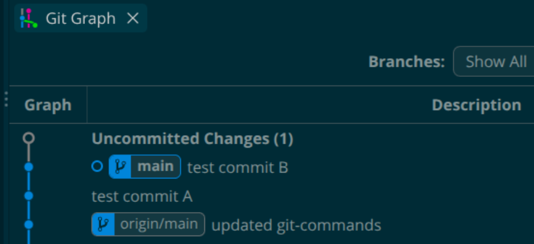
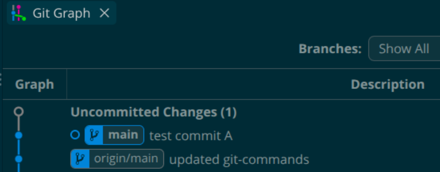
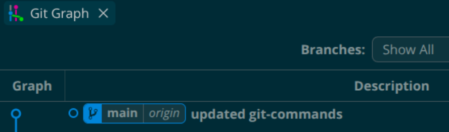
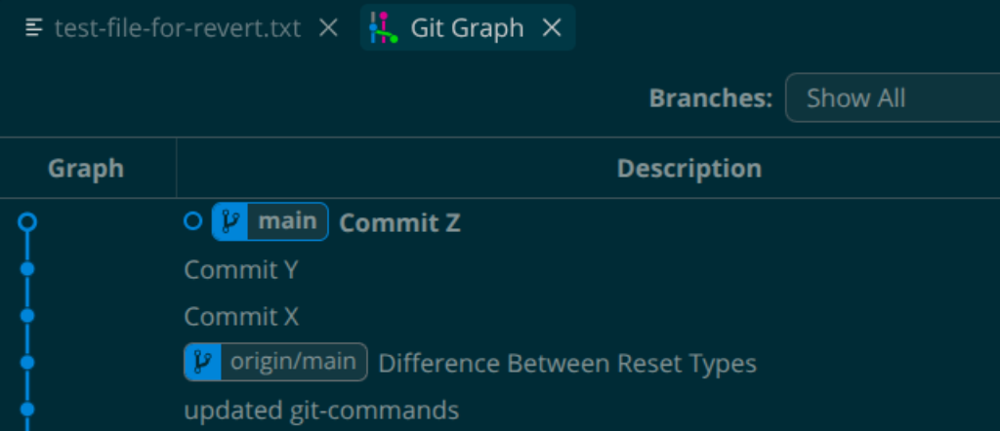
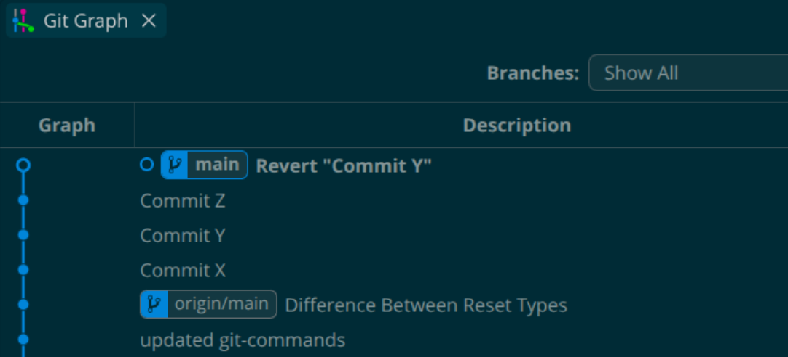

# Day 25 – Git Reset vs Revert & Branching Strategies

## Task 1: Git Reset — Hands-On

### Make 3 commits in your practice repo (commit A, B, C)

```bash
user@Machine:~/Downloads/devops-notes/Git$ git log --oneline | head
557cf28 updated git-commands

user@Machine:~/Downloads/devops-notes/Git$ git add .
user@Machine:~/Downloads/devops-notes/Git$ git commit -m "test commit A"
[main 4a2b0e9] test commit A
 1 file changed, 0 insertions(+), 0 deletions(-)
 create mode 100644 Git/test-folder/sample.txt
user@Machine:~/Downloads/devops-notes/Git$ git log --oneline | head
4a2b0e9 test commit A
557cf28 updated git-commands

user@Machine:~/Downloads/devops-notes/Git$ git status
On branch main
Your branch is ahead of 'origin/main' by 1 commit.
  (use "git push" to publish your local commits)
Changes not staged for commit:
  (use "git add <file>..." to update what will be committed)
  (use "git restore <file>..." to discard changes in working directory)
	modified:   test-folder/sample.txt
no changes added to commit (use "git add" and/or "git commit -a")

user@Machine:~/Downloads/devops-notes/Git$ git add .
user@Machine:~/Downloads/devops-notes/Git$ git commit -m "test commit B"
[main 6521c5d] test commit B
 1 file changed, 1 insertion(+)
user@Machine:~/Downloads/devops-notes/Git$ git status
On branch main
Your branch is ahead of 'origin/main' by 2 commits.
  (use "git push" to publish your local commits)
nothing to commit, working tree clean

user@Machine:~/Downloads/devops-notes/Git$ git status
On branch main
Your branch is ahead of 'origin/main' by 2 commits.
  (use "git push" to publish your local commits)
Changes not staged for commit:
  (use "git add <file>..." to update what will be committed)
  (use "git restore <file>..." to discard changes in working directory)
	modified:   test-folder/sample.txt
no changes added to commit (use "git add" and/or "git commit -a")

user@Machine:~/Downloads/devops-notes/Git$ git add .
user@Machine:~/Downloads/devops-notes/Git$ git commit -m "test commit C"
[main 10000ac] test commit C
 1 file changed, 1 insertion(+)
user@Machine:~/Downloads/devops-notes/Git$ git log --oneline | head
10000ac test commit C
6521c5d test commit B
4a2b0e9 test commit A
557cf28 updated git-commands
```


---

### Use git reset --soft to go back one commit — what happens to the changes?

```bach
user@Machine:~/Downloads/devops-notes/Git$ git reset --soft HEAD~1

user@Machine:~/Downloads/devops-notes/Git$ git log --oneline | head
6521c5d test commit B
4a2b0e9 test commit A
557cf28 updated git-commands

user@Machine:~/Downloads/devops-notes/Git$ git status
On branch main
Your branch is ahead of 'origin/main' by 2 commits.
  (use "git push" to publish your local commits)
Changes to be committed:
  (use "git restore --staged <file>..." to unstage)
	modified:   test-folder/sample.txt
```


- Observation:

  * Commit is removed from history.
  * Changes remain **staged**.
  * Files are ready to commit again.

---

### Re-commit, then use git reset --mixed to go back one commit — what happens now?

```bash
user@Machine:~/Downloads/devops-notes/Git$ git add .
user@Machine:~/Downloads/devops-notes/Git$ git commit -m "test commit C"
[main 32d395d] test commit C
 1 file changed, 1 insertion(+)

user@Machine:~/Downloads/devops-notes/Git$ git status
On branch main
Your branch is ahead of 'origin/main' by 3 commits.
  (use "git push" to publish your local commits)
nothing to commit, working tree clean

user@Machine:~/Downloads/devops-notes/Git$ git log --oneline | head
32d395d test commit C
6521c5d test commit B
4a2b0e9 test commit A
557cf28 updated git-commands

user@Machine:~/Downloads/devops-notes/Git$ git reset --mixed HEAD~1
Unstaged changes after reset:
M	Git/test-folder/sample.txt

user@Machine:~/Downloads/devops-notes/Git$ git status
On branch main
Your branch is ahead of 'origin/main' by 2 commits.
  (use "git push" to publish your local commits)
Changes not staged for commit:
  (use "git add <file>..." to update what will be committed)
  (use "git restore <file>..." to discard changes in working directory)
	modified:   test-folder/sample.txt
no changes added to commit (use "git add" and/or "git commit -a")

user@Machine:~/Downloads/devops-notes/Git$ git log --oneline | head
6521c5d test commit B
4a2b0e9 test commit A
557cf28 updated git-commands
```


Observation:

* Commit is removed.
* Changes remain in working directory.
* Changes become **unstaged**.

---
Before hard reset:



Re-commit, then use git reset --hard to go back one commit — what happens this time?

```bash
user@Machine:~/Downloads/devops-notes/Git$ git log --oneline | head
4a2b0e9 test commit A
557cf28 updated git-commands

user@Machine:~/Downloads/devops-notes/Git$ git reset --hard HEAD~1
HEAD is now at 557cf28 updated git-commands

user@Machine:~/Downloads/devops-notes/Git$ git status
On branch main
Your branch is up to date with 'origin/main'.
nothing to commit, working tree clean

user@Machine:~/Downloads/devops-notes/Git$ git log --oneline | head
557cf28 updated git-commands
```
After hard reset:



**Observation**:

* Commit is removed.
* Staged and unstaged changes are deleted.
* Working directory matches previous commit.

### Difference Between Reset Types

| Command | Changes left in Commit-zone? | Changes left in Staged-zone? | Changes left in Workspace? |
| ------- | -------------- | -------------- | ------------ |
| --soft  | No            | Yes            | Yes          |
| --mixed | No            | No             | Yes          |
| --hard  | No            | No             | No           |

### Which One Is Destructive? - `git reset --hard`
* Reason: Permanently removes uncommitted changes from working directory.

### When To Use?

* Soft → Modify last commit message or combine commits.
* Mixed → Unstage changes.
* Hard → Discard local work completely.

### Should Reset Be Used On Pushed Commits? - No.

* Reason: Rewrites Git history and can cause problems for collaborators.

## Task 2: Git Revert — Hands-On

### Make 3 commits (commit X, Y, Z)

```bash
user@Machine:~/Downloads/devops-notes/Git$ git status
On branch main
Your branch is up to date with 'origin/main'.
Untracked files:
  (use "git add <file>..." to include in what will be committed)
	test-file-for-revert.txt
nothing added to commit but untracked files present (use "git add" to track)

user@Machine:~/Downloads/devops-notes/Git$ git add .
user@Machine:~/Downloads/devops-notes/Git$ git commit -m "Commit X"
[main 7014db6] Commit X
 1 file changed, 1 insertion(+)
 create mode 100644 Git/test-file-for-revert.txt
user@Machine:~/Downloads/devops-notes/Git$ git status
On branch main
Your branch is ahead of 'origin/main' by 1 commit.
  (use "git push" to publish your local commits)
Changes not staged for commit:
  (use "git add <file>..." to update what will be committed)
  (use "git restore <file>..." to discard changes in working directory)
	modified:   test-file-for-revert.txt
no changes added to commit (use "git add" and/or "git commit -a")

user@Machine:~/Downloads/devops-notes/Git$ git add .
user@Machine:~/Downloads/devops-notes/Git$ git commit -m "Commit Y"
[main ba28206] Commit Y
 1 file changed, 1 insertion(+)
user@Machine:~/Downloads/devops-notes/Git$ git status
On branch main
Your branch is ahead of 'origin/main' by 2 commits.
  (use "git push" to publish your local commits)
Changes not staged for commit:
  (use "git add <file>..." to update what will be committed)
  (use "git restore <file>..." to discard changes in working directory)
	modified:   test-file-for-revert.txt
no changes added to commit (use "git add" and/or "git commit -a")

user@Machine:~/Downloads/devops-notes/Git$ git add .
user@Machine:~/Downloads/devops-notes/Git$ git commit -m "Commit Z"
[main db86dbe] Commit Z
 1 file changed, 1 insertion(+)
user@Machine:~/Downloads/devops-notes/Git$ git status
On branch main
Your branch is ahead of 'origin/main' by 3 commits.
  (use "git push" to publish your local commits)
nothing to commit, working tree clean

user@Machine:~/Downloads/devops-notes/Git$ git log --oneline | head -5
db86dbe Commit Z
ba28206 Commit Y
7014db6 Commit X
49a7bdf Difference Between Reset Types
557cf28 updated git-commands
```


### Revert commit Y (the middle one) — what happens?

```bash
user@Machine:~/Downloads/devops-notes/Git$ git revert ba28206
Auto-merging Git/test-file-for-revert.txt
CONFLICT (content): Merge conflict in Git/test-file-for-revert.txt
error: could not revert ba28206... Commit Y
hint: After resolving the conflicts, mark them with
hint: "git add/rm <pathspec>", then run
hint: "git revert --continue".
hint: You can instead skip this commit with "git revert --skip".
hint: To abort and get back to the state before "git revert",
hint: run "git revert --abort".

user@Machine:~/Downloads/devops-notes/Git$ git status
On branch main
Your branch is ahead of 'origin/main' by 3 commits.
  (use "git push" to publish your local commits)
You are currently reverting commit ba28206.
  (fix conflicts and run "git revert --continue")
  (use "git revert --skip" to skip this patch)
  (use "git revert --abort" to cancel the revert operation)
Unmerged paths:
  (use "git restore --staged <file>..." to unstage)
  (use "git add <file>..." to mark resolution)
	both modified:   test-file-for-revert.txt
no changes added to commit (use "git add" and/or "git commit -a")

user@Machine:~/Downloads/devops-notes/Git$ git log --oneline | head -5
db86dbe Commit Z
ba28206 Commit Y
7014db6 Commit X
49a7bdf Difference Between Reset Types
557cf28 updated git-commands

# After resolving conflict: 
user@Machine:~/Downloads/devops-notes/Git$ git add .
user@Machine:~/Downloads/devops-notes/Git$ git revert --continue
[main 8513ad5] Revert "Commit Y"
 1 file changed, 2 deletions(-)

user@Machine:~/Downloads/devops-notes/Git$ git status
On branch main
Your branch is ahead of 'origin/main' by 4 commits.
  (use "git push" to publish your local commits)
nothing to commit, working tree clean
user@Machine:~/Downloads/devops-notes/Git$ git log --oneline | head -5
8513ad5 Revert "Commit Y"
db86dbe Commit Z
ba28206 Commit Y
7014db6 Commit X
49a7bdf Difference Between Reset Types
```



### Check git log — is commit Y still in the history? - Yes
- Observation:
* New commit created that undoes commit Y.
* Original commit remains in history.


## Answer in your notes

### How is git revert different from git reset?

- git revert preserves history by creating an undo commit.
- git reset rewrites history by moving the branch back and removing commits from the branch history.


### Why is revert considered safer than reset for shared branches?
- git revert → Keeps all existing commits and adds a new "undo" commit.
- git reset → Changes branch history by removing commits from the current branch.
- On shared branches (like main), rewriting history with reset can cause conflicts and confusion for others who have already pulled those commits.

### When would you use revert vs reset?
- git revert is best for shared branches because it preserves history.
- git reset is best for local, unshared commits because it rewrites history.

## Task 3: Reset vs Revert — Summary

## Git Reset vs Git Revert

| Feature | `git reset` | `git revert` |
|----------|------------|-------------|
| **What it does** | Moves the branch pointer back and optionally removes commits | Creates a new commit that undoes the changes of a previous commit |
| **Removes commit from history?** | Yes | No |
| **Safe for shared/pushed branches?** | No | Yes |
| **When to use** | For local/unshared commits when you want to rewrite history | For shared/pushed commits when you want to undo changes safely |

### Summary

- **`git reset`** rewrites history by removing commits from the branch.
- **`git revert`** preserves history by creating a new commit that reverses earlier changes.
- Use **`git reset`** for local commits that have not been pushed.
- Use **`git revert`** for commits that have already been pushed or shared with others.

## Task 4: Branching Strategies

## Branching Strategies

### 1. Git Flow

**How it works:**

* Uses separate branches for development and production.
* Main branches: `main` and `develop`.
* Feature, release, and hotfix branches are created as needed.
* Suitable for projects with scheduled releases.

### 2. GitHub Flow

**How it works:**

* Uses a single `main` branch as the production branch.
* Create a feature branch for each change.
* Open a Pull Request (PR), review, and merge into `main`.
* Simple and ideal for continuous deployment.

### 3. GitLab Flow

**How it works:**

* Similar to GitHub Flow but includes environment branches such as `staging` and `production`.
* Changes are merged through environments before reaching production.
* Useful for teams with deployment stages.

### 4. Trunk-Based Development

**How it works:**

* Developers work on short-lived feature branches or directly on the main branch (trunk).
* Changes are merged frequently into the trunk.
* Encourages continuous integration and rapid delivery.
* Common in DevOps and Agile teams.

## A simple diagram or flow (text-based is fine)

## Branching Strategies

### 1. Git Flow

**How it works:**
- Uses `main` and `develop` as long-lived branches.
- Features are developed in feature branches.
- Releases and hotfixes use dedicated branches.

**Diagram:**
```text
main ────────────────●──────────────●
                      \            /
develop ──●────●──────●────●──────●
            \        /
feature ─────●──────●
```

---

### 2. GitHub Flow

**How it works:**
- Create a branch from `main`.
- Make changes and open a Pull Request.
- Review and merge back into `main`.

**Diagram:**
```text
main ──●──────────────●──────────────●
         \            /
feature ──●────●────●
```

---

### 3. GitLab Flow

**How it works:**
- Uses feature branches and environment branches.
- Changes move through staging before production.

**Diagram:**
```text
feature ──●────●
            \
main ────────●─────────●
                      \
staging ───────────────●
                        \
production ─────────────●
```

---

### 4. Trunk-Based Development

**How it works:**
- Developers frequently merge small changes into the main branch (trunk).
- Feature branches are short-lived.

**Diagram:**
```text
main ──●──●──●──●──●──●──●
         \ /    \ /
          ●      ●
      short-lived
    feature branches
```

## When/where it's used

### Git Flow

**When/Where it's used:**  
Used in large projects with planned releases and multiple development stages. Common in enterprise software development.

### GitHub Flow

**When/Where it's used:**  
Used for continuous deployment and rapid development. Common in web applications and small-to-medium development teams.

### GitLab Flow

**When/Where it's used:**  
Used when code moves through environments such as staging and production before release. Common in DevOps workflows.

### Trunk-Based Development

**When/Where it's used:**  
Used in Agile and CI/CD environments where developers merge small changes frequently. Common in modern DevOps teams.


## Pros and cons

### Git Flow

**Pros:**
- Well-structured and easy to manage releases.
- Supports parallel development with feature, release, and hotfix branches.

**Cons:**
- Complex for small projects.
- Requires more branch management and coordination.

---

### GitHub Flow

**Pros:**
- Simple and easy to understand.
- Supports continuous deployment and rapid releases.

**Cons:**
- Less suitable for projects with scheduled releases.
- Requires strong testing before merging to `main`.

---

### GitLab Flow

**Pros:**
- Integrates well with deployment environments.
- Provides a clear path from development to production.

**Cons:**
- More complex than GitHub Flow.
- Requires managing additional environment branches.

---

### Trunk-Based Development

**Pros:**
- Encourages frequent integration and faster feedback.
- Works well with CI/CD pipelines.

**Cons:**
- Requires good automated testing.
- Frequent merges can be challenging without team discipline.

---

### Which strategy would you use for a startup shipping fast?
- For a startup shipping fast, I would use GitHub Flow or Trunk-Based Development. Both encourage small, frequent changes and quick deployments, making them ideal for rapid development and continuous delivery.

### Which strategy would you use for a large team with scheduled releases?
- For a large team with scheduled releases, I would use Git Flow. It provides separate branches for development, releases, and hotfixes, making it easier to manage complex projects and planned release cycles.

### Which one does your favorite open-source project use? (check any repo on GitHub)
- My favorite open-source project is Kubernetes. It uses a GitHub-style workflow with feature branches and Pull Requests before merging into the main branch. This approach works well for large open-source communities.

---

## Task 5: Git Commands Reference Update
- Updated `git-commands.md` -> [Git Commands Cheat Sheet](https://github.com/robin-banerjee/devops-notes/blob/main/Git/git-commands.md)

---

# Git **Reflog** Guide: Fixing Reset & Revert Mistakes

`git reflog` (Reference Log) tracks every movement of `HEAD` locally. It acts as an undo history for Git operations, enabling recovery from mistaken resets, reverts, or bad commits—such as accidentally exposing API keys.

## Scenario: Hardcoded API Key Leak

### The Problem
You accidentally hardcoded an API key in a file, committed it, and pushed it to GitHub. You tried using `git reset --hard` or `git revert` to fix it, but ended up making mistakes in your local repository history.


## 1. Accidental Hard Reset (`git reset --hard`)

If you ran `git reset --hard` to remove the commit, but realized you wiped out good uncommitted work or reset to the wrong commit:

### Step 1: Check the Reflog
```bash
git reflog
```

**Output:**
```text
a1b2c3d HEAD@{0}: reset: moving to HEAD~1
e4f5g6h HEAD@{1}: commit: Add database integration with API key
7890xyz HEAD@{2}: commit: Fix user login logic
```

### Step 2: Recover to Before the Reset
Jump back to the safe commit state *before* your bad reset:
```bash
git reset --soft HEAD@{2}
```
*Note: Using `--soft` keeps your recent changes staged so you can clean out the API key manually before recommitting.*

## 2. Mistaken Revert (`git revert`)

If you ran `git revert <commit-id>` to undo the API key commit, but accidentally reverted the **wrong commit** or created unnecessary merge conflicts:

### Step 1: Identify the State Before Revert
```bash
git reflog
```

**Output:**
```text
3k4l5m6 HEAD@{0}: revert: Revert "Fix user login logic"
e4f5g6h HEAD@{1}: commit: Add database integration with API key
```

### Step 2: Undo the Revert
Restore `HEAD` to the exact commit prior to running the revert command:
```bash
git reset --hard HEAD@{1}
```

## Proper Way to Handle Exposed Secrets

After restoring your repository state using `reflog`, properly remove the key:

1. **Remove the API Key:** Clean the secret out of your code files.
2. **Amend or Rewrite the Commit:**
   ```bash
   git commit --amend --no-edit
   git push origin main --force
   ```
3. **Revoke the API Key:** Immediately rotate/revoke the leaked API key in your provider's dashboard (AWS, OpenAI, Stripe, etc.) as past commits in git history or forks may still expose it.

