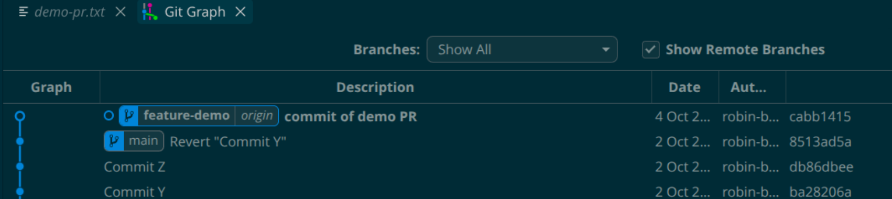
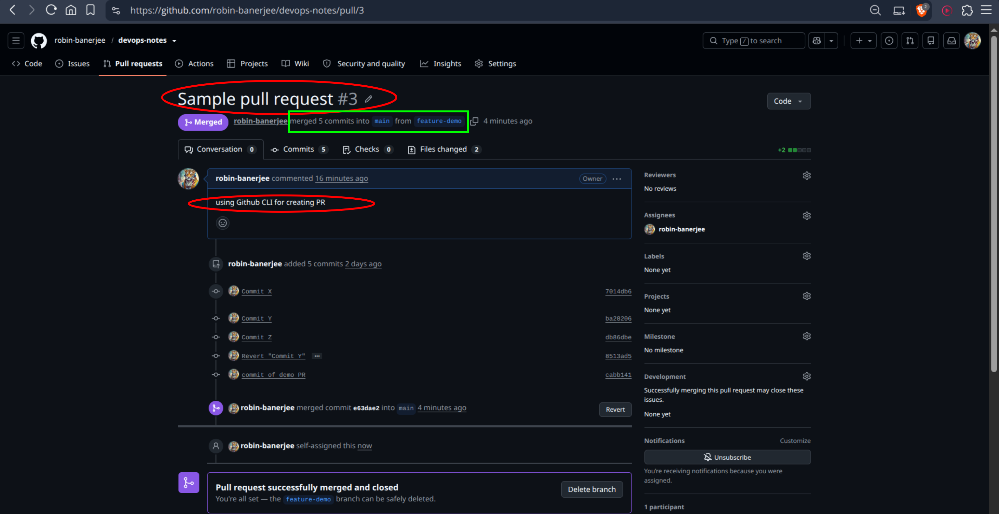
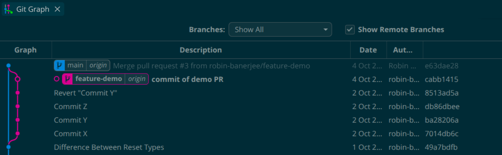
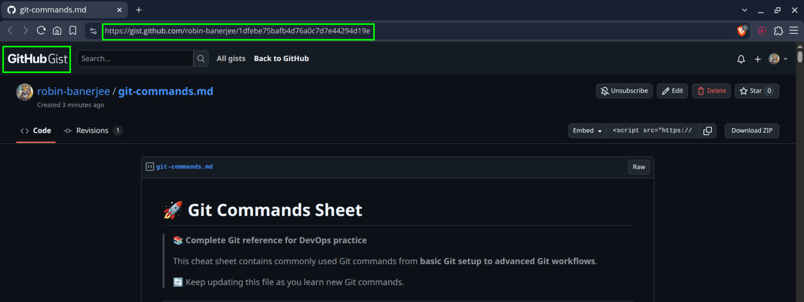
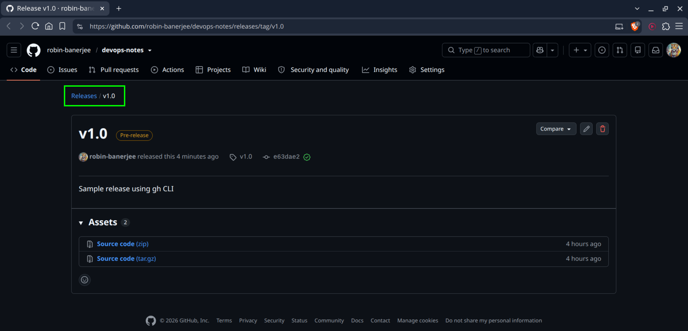

# Day 26 – GitHub CLI: Manage GitHub from Your Terminal

## Task 1: Install and Authenticate
1. Install the GitHub CLI on your machine
2. Authenticate with your GitHub account
3. Verify you're logged in and check which account is active
4. Answer in your notes: What authentication methods does `gh` support?
    - Web browser or personal access token

### Install GitHub CLI

Ubuntu: `sudo apt install gh`

Windows: `winget install GitHub.cli`

### Login `gh auth login`

### Verify Login `gh auth status`

### Authentication Methods Supported
* Browser-based authentication
* Personal Access Token (PAT)
* GitHub Enterprise authentication

```bash

user@Machine:~$ gh --version
Command 'gh' not found, but can be installed with:
sudo apt install gh

user@Machine:~$ sudo apt install gh
[sudo] password for user:
Reading package lists... Done
Building dependency tree... Done
Reading state information... Done
The following packages were automatically installed and are no longer required:
  cabextract cpu-checker docker-buildx-plugin docker-compose-plugin ipxe-qemu ipxe-qemu-256k-compat-efi-roms libcacard0
  libdaxctl1 libfdt1 libgit2-1.7 libhttp-parser2.9 libiscsi7 libmspack0t64 libndctl6 libpmem1 libpmemobj1 librados2 librbd1
  librdmacm1t64 libslirp0 libspice-server1 libsubid4 liburing2 libusbredirparser1t64 libvirglrenderer1
  linux-headers-6.18.7-76061807 linux-headers-6.18.7-76061807-generic linux-image-6.18.7-76061807-generic
  linux-modules-6.18.7-76061807-generic msr-tools ovmf pass qemu-block-extra qemu-system-common qemu-system-data
  qemu-system-gui qemu-system-modules-opengl qemu-system-modules-spice qemu-system-x86 qemu-utils qrencode seabios uidmap
  update-notifier-common wl-clipboard xclip
Use 'sudo apt autoremove' to remove them.
The following NEW packages will be installed:
  gh
0 upgraded, 1 newly installed, 0 to remove and 104 not upgraded.
Need to get 8,836 kB of archives.
After this operation, 45.4 MB of additional disk space will be used.
Get:1 http://apt.pop-os.org/ubuntu noble-security/universe amd64 gh amd64 2.45.0-1ubuntu0.3 [8,836 kB]
Fetched 8,836 kB in 3s (2,740 kB/s)
Selecting previously unselected package gh.
(Reading database… 315480 files and directories currently installed.)
Preparing to unpack …/gh_2.45.0-1ubuntu0.3_amd64.deb…
Unpacking gh (2.45.0-1ubuntu0.3)…
Setting up gh (2.45.0-1ubuntu0.3)…
Processing triggers for man-db (2.12.0-4build2)…

user@Machine:~$ gh --version
gh version 2.45.0 (2025-07-18 Ubuntu 2.45.0-1ubuntu0.3)
https://github.com/cli/cli/releases/tag/v2.45.0
```
```bash

user@Machine:~$ gh auth status
You are not logged into any GitHub hosts. To log in, run: gh auth login

user@Machine:~$ gh auth login
? What account do you want to log into? GitHub.com
? What is your preferred protocol for Git operations on this host? HTTPS
? Authenticate Git with your GitHub credentials? Yes
? How would you like to authenticate GitHub CLI? Login with a web browser

! First copy your one-time code: 8BA2-CDD7
Press Enter to open github.com in your browser...
Opening in existing browser session.
✓ Authentication complete.
- gh config set -h github.com git_protocol https
✓ Configured git protocol
✓ Logged in as robin-banerjee

user@Machine:~$ gh auth status
github.com
  ✓ Logged in to github.com account robin-banerjee (keyring)
  - Active account: true
  - Git operations protocol: https
  - Token: gho_************************************
  - Token scopes: 'gist', 'read:org', 'repo', 'workflow'
```


---

## Task 2: Working with Repositories
1. Create a **new GitHub repo** directly from the terminal — make it public with a README
2. Clone a repo using `gh` instead of `git clone`
3. View details of one of your repos from the terminal
4. List all your repositories
5. Open a repo in your browser directly from the terminal
6. Delete the test repo you created (be careful!)

### Create Repository `gh repo create <desired-repo-name> --public --clone --add-readme`
```bash

user@Machine:~$ gh repo create github-cli-practice --public --clone --add-readme
✓ Created repository robin-banerjee/github-cli-practice on GitHub
  https://github.com/robin-banerjee/github-cli-practice
Cloning into 'github-cli-practice'...
```


### Clone Repository `gh repo clone owner/repository`
```bash

user@Machine:~$ gh repo clone LondheShubham153/devboard-starter
Cloning into 'devboard-starter'...
remote: Enumerating objects: 237, done.
remote: Counting objects: 100% (237/237), done.
remote: Compressing objects: 100% (161/161), done.
remote: Total 237 (delta 91), reused 197 (delta 58), pack-reused 0 (from 0)
Receiving objects: 100% (237/237), 139.45 KiB | 850.00 KiB/s, done.
Resolving deltas: 100% (91/91), done.
```

### View Repository Details `gh repo view`
```bash

user@Machine:~$ gh repo view github-cli-practice
robin-banerjee/github-cli-practice
No description provided

   github-cli-practice

View this repository on GitHub: https://github.com/robin-banerjee/github-cli-practice
```

### List Repositories `gh repo list`
```bash

user@Machine:~$ gh repo list

Showing 30 of 83 repositories in @robin-banerjee

NAME                                        DESCRIPTION                                      INFO          UPDATED
robin-banerjee/github-cli-practice                                                           public        about 36 minutes ago
robin-banerjee/90DaysOfDevOps               This is my journey of DevOps over 90 days wi...  public        about 21 hours ago
robin-banerjee/tws-labs                     Hands-on DevOps, Cloud and AI labs in a real...  public, fork  about 1 day ago
robin-banerjee/devops-notes                 This repo will help me keep track of my casu...  public        about 1 day ago
robin-banerjee/10WeeksOfAWS                 AWS Solutions Architect Associate practice       public, fork  about 6 days ago
robin-banerjee/python-for-devops            Python For DevOps [AI Edition] is a hands-on...  public, fork  about 26 days ago
...
...
```

### Open Repository in Browser `gh repo view --web`
```bash

user@Machine:~/github-cli-practice$ gh repo view --web
Opening github.com/robin-banerjee/github-cli-practice in your browser.

user@Machine:~/github-cli-practice$ Opening in existing browser session.
```

### Delete Repository `gh repo delete owner/repository`
```bash

user@Machine:~$ gh repo delete robin-banerjee/github-cli-practice
? Type robin-banerjee/github-cli-practice to confirm deletion: robin-banerjee/github-cli-practice
HTTP 403: Must have admin rights to Repository. (https://api.github.com/repos/robin-banerjee/github-cli-practice)
This API operation needs the "delete_repo" scope. To request it, run:  gh auth refresh -h github.com -s delete_repo

user@Machine:~$ gh auth refresh -h github.com -s delete_repo

! First copy your one-time code: 8D0C-3B50
Press Enter to open github.com in your browser...
Opening in existing browser session.
✓ Authentication complete.

user@Machine:~$ gh repo delete robin-banerjee/github-cli-practice
? Type robin-banerjee/github-cli-practice to confirm deletion: robin-banerjee/github-cli-practice
✓ Deleted repository robin-banerjee/github-cli-practice

user@Machine:~$ gh repo list

Showing 30 of 82 repositories in @robin-banerjee

NAME                                        DESCRIPTION                                        INFO          UPDATED
robin-banerjee/90DaysOfDevOps               This is my journey of DevOps over 90 days with...  public        about 22 hours ago
robin-banerjee/tws-labs                     Hands-on DevOps, Cloud and AI labs in a real L...  public, fork  about 1 day ago
robin-banerjee/devops-notes                 This repo will help me keep track of my casual...  public        about 1 day ago
robin-banerjee/10WeeksOfAWS                 AWS Solutions Architect Associate practice         public, fork  about 6 days ago
robin-banerjee/python-for-devops            Python For DevOps [AI Edition] is a hands-on, ...  public, fork  about 26 days ago
...
...
```

---

## Task 3: Issues
1. Create an issue on one of your repos from the terminal — give it a title, body, and a label
2. List all open issues on that repo
3. View a specific issue by its number
4. Close an issue from the terminal
5. Answer in your notes: How could you use `gh issue` in a script or automation?
    * By combining gh issue commands in a script, you can automate workflows such as:
      - gh issue list
      - gh issue comment <issue num>
      - gh issue close <issue num>

### Create Issue

```bash

user@Machine:~/Downloads/devops-notes$ gh issue list
no open issues in robin-banerjee/devops-notes

user@Machine:~/Downloads/devops-notes$ gh label create "Sample Issue" --repo robin-banerjee/devops-notes --color "1d76db" --description "A sample issue label"
✓ Label "Sample Issue" created in robin-banerjee/devops-notes

user@Machine:~/Downloads/devops-notes$ gh label list --repo robin-banerjee/devops-notes

Showing 10 of 10 labels in robin-banerjee/devops-notes

NAME              DESCRIPTION                                 COLOR
bug               Something isn't working                     #d73a4a
documentation     Improvements or additions to documentation  #0075ca
duplicate         This issue or pull request already exists   #cfd3d7
enhancement       New feature or request                      #a2eeef
good first issue  Good for newcomers                          #7057ff
help wanted       Extra attention is needed                   #008672
invalid           This doesn't seem right                     #e4e669
question          Further information is requested            #d876e3
wontfix           This will not be worked on                  #ffffff
Sample Issue      A sample issue label                        #1d76db

user@Machine:~/Downloads/devops-notes$ gh issue create \
  --repo robin-banerjee/devops-notes \
  --title "Test Issue" \
  --body "Issue created with github CLI" \
  --label "Sample Issue"

Creating issue in robin-banerjee/devops-notes

https://github.com/robin-banerjee/devops-notes/issues/2
```


(**Hint: `gh pr create --fill` auto-fills the PR title and body from your commits**)

### List Issues

```bash

user@Machine:~/Downloads/devops-notes$ gh issue list --repo robin-banerjee/devops-notes

Showing 1 of 1 open issue in robin-banerjee/devops-notes

ID  TITLE       LABELS        UPDATED
#2  Test Issue  Sample Issue  about 57 minutes ago
```

### View Issue `gh issue view <issue-ID> --repo <owner/repository> --json number,title,state,author,body`

```bash

user@Machine:~/Downloads/devops-notes$ gh issue view 2 --repo robin-banerjee/devops-notes --json number,title,state,author,body
{
  "author": {
    "id": "MDQ6VXNlcjM2NzYyMjY0",
    "is_bot": false,
    "login": "robin-banerjee",
    "name": "Robin Banerjee"
  },
  "body": "Issue created with github CLI",
  "number": 2,
  "state": "OPEN",
  "title": "Test Issue"
}
```

### Close Issue `gh issue close <issue-ID>`

```bash

user@Machine:~/Downloads/devops-notes$ gh issue close 2 \
  --repo robin-banerjee/devops-notes \
  --comment "Issue resolved and closed."
✓ Closed issue #2 (Test Issue)

user@Machine:~/Downloads/devops-notes$ gh issue list --repo robin-banerjee/devops-notes
no open issues in robin-banerjee/devops-notes
```


### How gh issue Helps Automation?
* Auto-create issues from monitoring alerts
* Create incident tickets automatically
* Generate bug reports from CI/CD failures
    
---

## Task 4: Pull Requests
1. Create a branch, make a change, push it, and create a **pull request** entirely from the terminal
2. List all open PRs on a repo
3. View the details of your PR — check its status, reviewers, and checks
4. Merge your PR from the terminal

```bash

user@Machine:~/Downloads/devops-notes$ git branch
  feature-dashboard
  feature-hotfix
  feature-login
  feature-profile
  feature-settings
  feature-signup
* main

user@Machine:~/Downloads/devops-notes$ git checkout -b feature-demo
Switched to a new branch 'feature-demo'

user@Machine:~/Downloads/devops-notes$ cd Git

user@Machine:~/Downloads/devops-notes/Git$ cat > demo-pr.txt
this file is for testing PR using gh CLI

user@Machine:~/Downloads/devops-notes/Git$ ls
cherry-pick  demo-pr.txt  git-commands.md  README.md  test-file-for-revert.txt
```
```bash

user@Machine:~/Downloads/devops-notes/Git$ git status
On branch feature-demo
Untracked files:
  (use "git add <file>..." to include in what will be committed)
	demo-pr.txt
nothing added to commit but untracked files present (use "git add" to track)

user@Machine:~/Downloads/devops-notes/Git$ git add .

user@Machine:~/Downloads/devops-notes/Git$ git commit -m "commit of demo PR"
[feature-demo cabb141] commit of demo PR
 1 file changed, 1 insertion(+)
 create mode 100644 Git/demo-pr.txt

user@Machine:~/Downloads/devops-notes/Git$ git push origin feature-demo
Enumerating objects: 6, done.
Counting objects: 100% (6/6), done.
Delta compression using up to 12 threads
Compressing objects: 100% (3/3), done.
Writing objects: 100% (4/4), 376 bytes | 376.00 KiB/s, done.
Total 4 (delta 2), reused 0 (delta 0), pack-reused 0
remote: Resolving deltas: 100% (2/2), completed with 2 local objects.
To github.com:robin-banerjee/devops-notes.git
   8513ad5..cabb141  feature-demo -> feature-demo

user@Machine:~/Downloads/devops-notes/Git$ git status
On branch feature-demo
nothing to commit, working tree clean
```


```bash

user@Machine:~/Downloads/devops-notes$ gh pr list
no open pull requests in robin-banerjee/devops-notes

user@Machine:~/Downloads/devops-notes$ git branch
  feature-dashboard
* feature-demo
  feature-hotfix
  feature-login
  feature-profile
  feature-settings
  feature-signup
  main

user@Machine:~/Downloads/devops-notes$ gh pr create
Creating pull request for feature-demo into main in robin-banerjee/devops-notes
? Title Sample pull request
? Body <Received>
? What's next? Submit
https://github.com/robin-banerjee/devops-notes/pull/3


user@Machine:~/Downloads/devops-notes$ gh pr list
Showing 1 of 1 open pull request in robin-banerjee/devops-notes
ID  TITLE                BRANCH        CREATED AT
#3  Sample pull request  feature-demo  less than a minute ago
```
```bash

user@Machine:~/Downloads/devops-notes$ gh pr view 3 --json
additions             comments              id                    mergedBy              reviewRequests
assignees             commits               isCrossRepository     mergeStateStatus      reviews
author                createdAt             isDraft               milestone             state
autoMergeRequest      deletions             labels                number                statusCheckRollup
baseRefName           files                 latestReviews         potentialMergeCommit  title
body                  headRefName           maintainerCanModify   projectCards          updatedAt
changedFiles          headRefOid            mergeable             projectItems          url
closed                headRepository        mergeCommit           reactionGroups
closedAt              headRepositoryOwner   mergedAt              reviewDecision


user@Machine:~/Downloads/devops-notes$ gh pr view 3 --json body,reviewRequests,reviewDecision,state,title,url
{
  "body": "using Github CLI for creating PR\n",
  "reviewDecision": "",
  "reviewRequests": [],
  "state": "OPEN",
  "title": "Sample pull request",
  "url": "https://github.com/robin-banerjee/devops-notes/pull/3"
}


user@Machine:~/Downloads/devops-notes$ gh pr list
Showing 1 of 1 open pull request in robin-banerjee/devops-notes
ID  TITLE                BRANCH        CREATED AT
#3  Sample pull request  feature-demo  about 11 minutes ago

user@Machine:~/Downloads/devops-notes$ gh pr merge 3
Merging pull request #3 (Sample pull request)
? What merge method would you like to use? Create a merge commit
? Delete the branch locally and on GitHub? No
? What's next? Submit
✓ Merged pull request #3 (Sample pull request)

user@Machine:~/Downloads/devops-notes$ gh pr view 3 --json body,reviewRequests,reviewDecision,state,title,url
{
  "body": "using Github CLI for creating PR\n",
  "reviewDecision": "",
  "reviewRequests": [],
  "state": "MERGED",
  "title": "Sample pull request",
  "url": "https://github.com/robin-banerjee/devops-notes/pull/3"
}

user@Machine:~/Downloads/devops-notes$ gh pr list
no open pull requests in robin-banerjee/devops-notes

user@Machine:~/Downloads/devops-notes$ gh pr checkout 3
Already on 'feature-demo'
Already up to date.

user@Machine:~/Downloads/devops-notes$ gh pr review 3 --approve
failed to create review: GraphQL: Review Can not approve your own pull request (addPullRequestReview)
```


    
```bash

user@Machine:~/Downloads/devops-notes$ git branch 
  feature-dashboard
  feature-demo
  feature-hotfix
  feature-login
  feature-profile
  feature-settings
  feature-signup
* main

user@Machine:~/Downloads/devops-notes$ git fetch
remote: Enumerating objects: 1, done.
remote: Counting objects: 100% (1/1), done.
remote: Total 1 (delta 0), reused 0 (delta 0), pack-reused 0 (from 0)
Unpacking objects: 100% (1/1), 906 bytes | 906.00 KiB/s, done.
From github.com:robin-banerjee/devops-notes
   49a7bdf..e63dae2  main       -> origin/main

user@Machine:~/Downloads/devops-notes$ git pull
Updating 8513ad5..e63dae2
Fast-forward
 Git/demo-pr.txt | 1 +
 1 file changed, 1 insertion(+)
 create mode 100644 Git/demo-pr.txt

user@Machine:~/Downloads/devops-notes$ git log --oneline 
e63dae2 (HEAD -> main, origin/main) Merge pull request #3 from robin-banerjee/feature-demo
cabb141 (origin/feature-demo, feature-demo) commit of demo PR
8513ad5 Revert "Commit Y"
db86dbe Commit Z
ba28206 Commit Y
7014db6 Commit X
49a7bdf Difference Between Reset Types
557cf28 updated git-commands
```



5. Answer in your notes:

   - What merge methods does `gh pr merge` support?
      * merge commit (`gh pr merge 1 --merge`)
      * rebase merge (`gh pr merge 1 --rebase`)
      * squash merge (`gh pr merge 1 --squash`)

   - How would you review someone else's PR using `gh`?
      * To review someone else's PR using GitHub CLI:
        - View the PR (`gh pr view --web`) 
        - Inspect the changes (`gh pr diff`)
        - Optionally check it out locally (`gh pr checkout <pr-number>`)
        - Submit a review (`gh pr review <pr-number> --approve`)

---

## Task 5: GitHub Actions & Workflows (Preview)

### List the workflow runs on any public repo that uses GitHub Actions
```bash

user@Machine:~/Downloads/devops-notes$ gh run list
no runs found
```

### View the status of a specific workflow run

```bash
gh run view <run-id> --repo <owner/repository> --json status,conclusion
```

### How could gh run and gh workflow be useful in a CI/CD pipeline?
- `gh workflow` can be used to manage and trigger GitHub Actions workflows, while `gh run` can be used to monitor, inspect, rerun, and troubleshoot workflow executions. Together, they help automate, track, and maintain CI/CD pipelines directly from the terminal.
  * Monitor pipeline status
  * Trigger workflows automatically
  * Debug failed deployments
  * Automate release management

---

## Task 6: Useful gh Commands

### GitHub API - make raw GitHub API calls from the terminal

- `gh api` to interact directly with GitHub REST and GraphQL APIs from the terminal for automation and advanced repository management.
- Example: gh api <owner/repository>

```bash

user@Machine:~/Downloads/devops-notes$ gh api repos/robin-banerjee/devops-notes
{
  "id": 1254879845,
  "node_id": "R_kgDOSsvyZQ",
  "name": "devops-notes",
  "full_name": "robin-banerjee/devops-notes",
  "private": false,
  "owner": 
  {
    "login": "robin-banerjee",
    "id": 36762264,
    "node_id": "MDQ6VXNlcjM2NzYyMjY0",
    "avatar_url": "https://avatars.githubusercontent.com/u/36762264?v=4",
    "gravatar_id": "",
    "url": "https://api.github.com/users/robin-banerjee",
    "html_url": "https://github.com/robin-banerjee",
    "followers_url": "https://api.github.com/users/robin-banerjee/followers",
    "following_url": "https://api.github.com/users/robin-banerjee/following{/other_user}",
    "gists_url": "https://api.github.com/users/robin-banerjee/gists{/gist_id}",
    "starred_url": "https://api.github.com/users/robin-banerjee/starred{/owner}{/repo}",
    "subscriptions_url": "https://api.github.com/users/robin-banerjee/subscriptions",
    "organizations_url": "https://api.github.com/users/robin-banerjee/orgs",
    "repos_url": "https://api.github.com/users/robin-banerjee/repos",
    "events_url": "https://api.github.com/users/robin-banerjee/events{/privacy}",
    "received_events_url": "https://api.github.com/users/robin-banerjee/received_events",
    "type": "User",
    "user_view_type": "public",
    "site_admin": false
  },
  "html_url": "https://github.com/robin-banerjee/devops-notes",
  "description": "This repo will help me keep track of my casual devops practice",
  "fork": false,
  "url": "https://api.github.com/repos/robin-banerjee/devops-notes",
  "forks_url": "https://api.github.com/repos/robin-banerjee/devops-notes/forks",
  "keys_url": "https://api.github.com/repos/robin-banerjee/devops-notes/keys{/key_id}",
  "collaborators_url": "https://api.github.com/repos/robin-banerjee/devops-notes/collaborators{/collaborator}",
  "teams_url": "https://api.github.com/repos/robin-banerjee/devops-notes/teams",
  "hooks_url": "https://api.github.com/repos/robin-banerjee/devops-notes/hooks",
  "issue_events_url": "https://api.github.com/repos/robin-banerjee/devops-notes/issues/events{/number}",
  "events_url": "https://api.github.com/repos/robin-banerjee/devops-notes/events",
  "assignees_url": "https://api.github.com/repos/robin-banerjee/devops-notes/assignees{/user}",
  "branches_url": "https://api.github.com/repos/robin-banerjee/devops-notes/branches{/branch}",
  "tags_url": "https://api.github.com/repos/robin-banerjee/devops-notes/tags",
  "blobs_url": "https://api.github.com/repos/robin-banerjee/devops-notes/git/blobs{/sha}",
  "git_tags_url": "https://api.github.com/repos/robin-banerjee/devops-notes/git/tags{/sha}",
  "git_refs_url": "https://api.github.com/repos/robin-banerjee/devops-notes/git/refs{/sha}",
  "trees_url": "https://api.github.com/repos/robin-banerjee/devops-notes/git/trees{/sha}",
  "statuses_url": "https://api.github.com/repos/robin-banerjee/devops-notes/statuses/{sha}",
  "languages_url": "https://api.github.com/repos/robin-banerjee/devops-notes/languages",
  "stargazers_url": "https://api.github.com/repos/robin-banerjee/devops-notes/stargazers",
  "contributors_url": "https://api.github.com/repos/robin-banerjee/devops-notes/contributors",
  "subscribers_url": "https://api.github.com/repos/robin-banerjee/devops-notes/subscribers",
  "subscription_url": "https://api.github.com/repos/robin-banerjee/devops-notes/subscription",
  "commits_url": "https://api.github.com/repos/robin-banerjee/devops-notes/commits{/sha}",
  "git_commits_url": "https://api.github.com/repos/robin-banerjee/devops-notes/git/commits{/sha}",
  "comments_url": "https://api.github.com/repos/robin-banerjee/devops-notes/comments{/number}",
  "issue_comment_url": "https://api.github.com/repos/robin-banerjee/devops-notes/issues/comments{/number}",
  "contents_url": "https://api.github.com/repos/robin-banerjee/devops-notes/contents/{+path}",
  "compare_url": "https://api.github.com/repos/robin-banerjee/devops-notes/compare/{base}...{head}",
  "merges_url": "https://api.github.com/repos/robin-banerjee/devops-notes/merges",
  "archive_url": "https://api.github.com/repos/robin-banerjee/devops-notes/{archive_format}{/ref}",
  "downloads_url": "https://api.github.com/repos/robin-banerjee/devops-notes/downloads",
  "issues_url": "https://api.github.com/repos/robin-banerjee/devops-notes/issues{/number}",
  "pulls_url": "https://api.github.com/repos/robin-banerjee/devops-notes/pulls{/number}",
  "milestones_url": "https://api.github.com/repos/robin-banerjee/devops-notes/milestones{/number}",
  "notifications_url": "https://api.github.com/repos/robin-banerjee/devops-notes/notifications{?since,all,participating}",
  "labels_url": "https://api.github.com/repos/robin-banerjee/devops-notes/labels{/name}",
  "releases_url": "https://api.github.com/repos/robin-banerjee/devops-notes/releases{/id}",
  "deployments_url": "https://api.github.com/repos/robin-banerjee/devops-notes/deployments",
  "created_at": "2026-05-31T05:36:04Z",
  "updated_at": "2026-10-04T06:11:44Z",
  "pushed_at": "2026-10-04T06:11:39Z",
  "git_url": "git://github.com/robin-banerjee/devops-notes.git",
  "ssh_url": "git@github.com:robin-banerjee/devops-notes.git",
  "clone_url": "https://github.com/robin-banerjee/devops-notes.git",
  "svn_url": "https://github.com/robin-banerjee/devops-notes",
  "homepage": "",
  "size": 134800,
  "stargazers_count": 0,
  "watchers_count": 0,
  "language": "Shell",
  "has_issues": true,
  "has_projects": true,
  "has_downloads": false,
  "has_wiki": true,
  "has_pages": false,
  "has_discussions": false,
  "forks_count": 1,
  "mirror_url": null,
  "archived": false,
  "disabled": false,
  "open_issues_count": 0,
  "license": null,
  "allow_forking": true,
  "is_template": false,
  "web_commit_signoff_required": false,
  "has_pull_requests": true,
  "pull_request_creation_policy": "all",
  "topics": [],
  "visibility": "public",
  "forks": 1,
  "open_issues": 0,
  "watchers": 0,
  "default_branch": "main",
  "permissions": 
  {
    "admin": true,
    "maintain": true,
    "push": true,
    "triage": true,
    "pull": true
  },
  "temp_clone_token": "",
  "allow_squash_merge": true,
  "allow_merge_commit": true,
  "allow_rebase_merge": true,
  "allow_auto_merge": false,
  "delete_branch_on_merge": false,
  "allow_update_branch": false,
  "use_squash_pr_title_as_default": false,
  "squash_merge_commit_message": "COMMIT_MESSAGES",
  "squash_merge_commit_title": "COMMIT_OR_PR_TITLE",
  "merge_commit_message": "PR_TITLE",
  "merge_commit_title": "MERGE_MESSAGE",
  "security_and_analysis": 
  {
    "secret_scanning": 
    {
      "status": "enabled"
    },
    "secret_scanning_push_protection": 
    {
      "status": "enabled"
    },
    "dependabot_security_updates": 
    {
      "status": "disabled"
    },
    "secret_scanning_non_provider_patterns": 
    {
      "status": "disabled"
    },
    "secret_scanning_validity_checks": 
    {
      "status": "disabled"
    }
  },
  "network_count": 1,
  "subscribers_count": 0
}
```

### Gists - create and manage GitHub Gists

- A GitHub Gist is a simple way to share code snippets, notes, configuration files, or small pieces of text on GitHub without creating a full repository.
- Created and shared a GitHub Gist from the terminal using gh gist create, and learnt that the file must exist before creating the gist.
- Example: `gh gist` create notes.txt

```bash

user@Machine:~/Downloads/devops-notes/Git$ gh gist create demo-pr.txt --public
- Creating gist demo-pr.txt
✓ Created public gist demo-pr.txt
https://gist.github.com/robin-banerjee/1c498dd23a3e63c540acda46d6e8c301

user@Machine:~/Downloads/devops-notes/Git$ gh gist create git-commands.md --public
- Creating gist git-commands.md
✓ Created public gist git-commands.md
https://gist.github.com/robin-banerjee/1dfebe75bafb4d76a0c7d7e44294d19e

user@Machine:~/Downloads/devops-notes/Git$ gh gist list
ID                                DESCRIPTION      FILES   VISIBILITY  UPDATED
1dfebe75bafb4d76a0c7d7e44294d19e  git-commands.md  1 file  public      less than a minute ago
1c498dd23a3e63c540acda46d6e8c301  demo-pr.txt      1 file  public      about 9 minutes ago
```




### Releases - create and manage releases

- A Release is a stable, officially published version of your code which is complete with release notes and downloadable packages, frozen in time for users and systems to consume
- `gh release` automates and streamlines publishing those stable versions, release notes, and downloadable assets directly from your terminal without needing a web browser
```bash

user@Machine:~/Downloads/devops-notes$ gh release create v1.0
? Title (optional) v1.0
? Release notes Write my own
? Is this a prerelease? Yes
? Submit? Publish release
https://github.com/robin-banerjee/devops-notes/releases/tag/v1.0

user@Machine:~/Downloads/devops-notes$ gh release list
TITLE  TYPE         TAG NAME  PUBLISHED
v1.0   Pre-release  v1.0      about 1 minute ago

user@Machine:~/Downloads/devops-notes$ gh release view v1.0
v1.0
Pre-release • robin-banerjee released this about 1 minute ago
  Sample release using gh CLI
View on GitHub: https://github.com/robin-banerjee/devops-notes/releases/tag/v1.0
```



```bash

user@Machine:~/Downloads/devops-notes$ gh release delete v1.0
? Delete release v1.0 in robin-banerjee/devops-notes? Yes
✓ Deleted release v1.0
! Note that the v1.0 git tag still remains in the repository

user@Machine:~/Downloads/devops-notes$ gh release list
no releases found
```

### Aliases - create shortcuts for commands you use often

- gh alias is a GitHub CLI command used to create custom shortcuts for frequently used or lengthy gh commands, helping you save keystrokes

```bash

user@Machine:~/Downloads/devops-notes$ gh alias set prs "pr list"
- Creating alias for prs: pr list
✓ Added alias prs

user@Machine:~/Downloads/devops-notes$ gh prs
no open pull requests in robin-banerjee/devops-notes

user@Machine:~/Downloads/devops-notes$ gh alias list
co: pr checkout
prs: pr list
```

### Search Repositories -search GitHub repos from the terminal

- Search GitHub repositories directly from terminal using the GitHub CLI search extension (gh search)
- Can narrow down search using specific flags (--language, --owner, --limit, --json)

```bash

user@Machine:~/Downloads/devops-notes$ gh search repos "terraform" --limit 5

Showing 5 of 483984 repositories
NAME                                   DESCRIPTION                                                VISIBILITY  UPDATED
hashicorp/terraform                    Terraform enables you to safely and predictably create...  public      about 3 hours ago
Azure/terraform                        Source code for the Azure Marketplace Terraform develo...  public      about 6 hours ago
collabnix/terraform                    Terraform - Beginners | Intermediate | Advanced            public      about 1 day ago
hashicorp/terraform-provider-aws       The AWS Provider enables Terraform to manage AWS resou...  public      about 3 hours ago
iam-veeramalla/terraform-zero-to-hero  Master Terraform in 7 days using this Zero to Hero cou...  public      about 1 hour ago
```

---

## Favorite GitHub CLI Commands

```bash
gh auth status
gh repo list
gh issue list
gh pr create
gh run list
```

---

# What I Learned

## GitHub CLI (gh) Comprehensive Cheat Sheet

| Task / Category | Action / Command Syntax | Description |
| :--- | :--- | :--- |
| **Task 1: Auth** | `gh auth login` <br> `gh auth status` | Authenticate with GitHub (supports Web browser login & Personal Access Tokens/PATs) and verify active account. |
| **Task 2: Repos** | `gh repo create <name> --public --readme` <br> `gh repo clone <owner>/<repo>` <br> `gh repo view <repo>` <br> `gh repo list` <br> `gh repo view --web` <br> `gh repo delete <repo>` | Create, clone, inspect, list, browse in browser, and delete repositories directly from the terminal. |
| **Task 3: Issues** | `gh issue create --title "..." --body "..." --label "..."` <br> `gh issue list` <br> `gh issue view <number>` <br> `gh issue close <number>` | Create, list, view, and close GitHub issues. *Automation note: Use with `--json` and flags in scripts for automated triage.* |
| **Task 4: PRs** | `git checkout -b <branch>` <br> `git push -u origin <branch>` <br> `gh pr create --title "..." --body "..."` <br> `gh pr list` <br> `gh pr view <number>` <br> `gh pr merge <number>` | End-to-end pull request workflow from branching to merging. Supports merge methods: `--merge`, `--squash`, `--rebase`. Review others using `gh pr checkout <number>`. |
| **Task 5: Actions** | `gh run list` <br> `gh run view <run-id>` | Inspect workflow runs and pipeline statuses. *Useful for local CI/CD debugging and tracking automated builds.* |
| **Task 6: Tricks** | `gh api <endpoint>` <br> `gh gist create <file>` <br> `gh release create <tag>` <br> `gh alias set <short> <cmd>` <br> `gh search repos "<query>"` | Advanced CLI extensions: raw API calls, gists, releases, custom command aliases, and repository search. |


1. GitHub repositories can be managed entirely from terminal.
2. Pull Requests and Issues can be automated using GitHub CLI.
3. GitHub CLI integrates well with CI/CD workflows.
4. GitHub Actions can be monitored directly from terminal.
5. GitHub CLI improves productivity by reducing browser dependency.