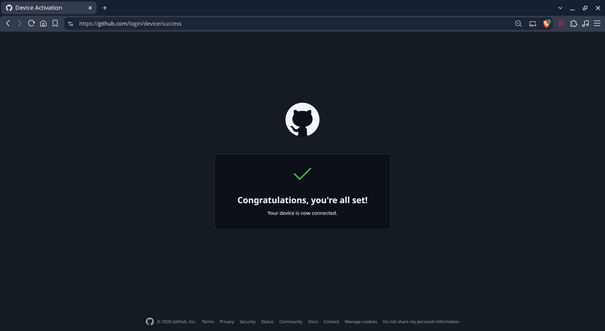
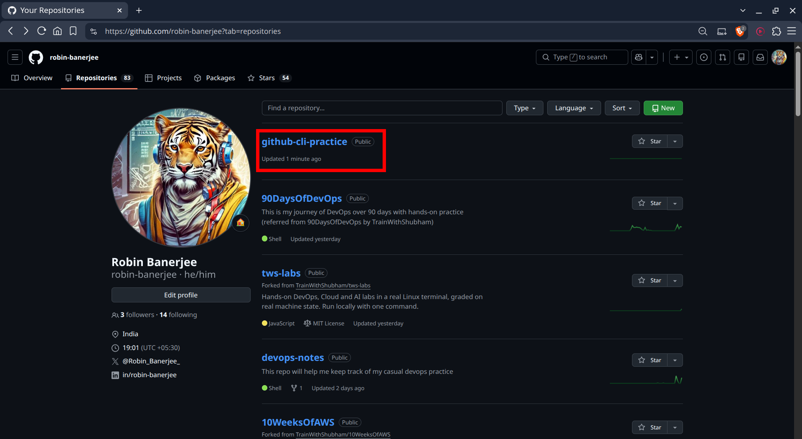
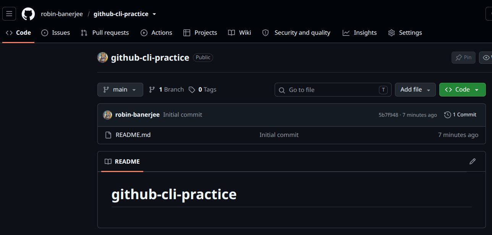
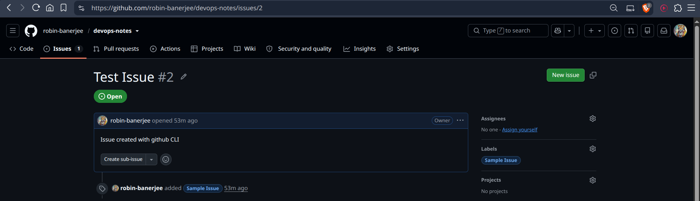
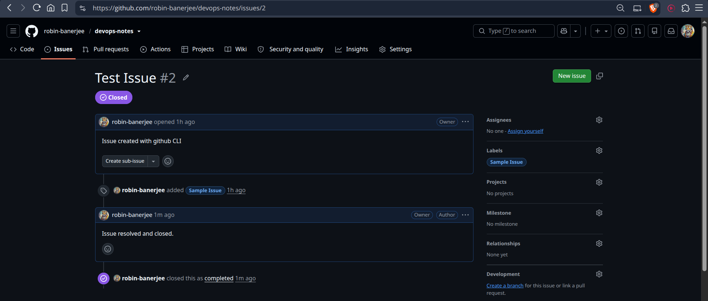

# Day 26 – GitHub CLI: Manage GitHub from Your Terminal

## Task 1: Install and Authenticate
1. Install the GitHub CLI on your machine
2. Authenticate with your GitHub account
3. Verify you're logged in and check which account is active
4. Answer in your notes: What authentication methods does `gh` support?
    - Web browser or personal access token

### Install GitHub CLI

Ubuntu: `sudo apt install gh`

Windows: `winget install GitHub.cli`

### Login `gh auth login`

### Verify Login `gh auth status`

### Authentication Methods Supported
* Browser-based authentication
* Personal Access Token (PAT)
* GitHub Enterprise authentication

```bash
user@Machine:~$ gh --version
Command 'gh' not found, but can be installed with:
sudo apt install gh
user@Machine:~$ sudo apt install gh
[sudo] password for user:
Reading package lists... Done
Building dependency tree... Done
Reading state information... Done
The following packages were automatically installed and are no longer required:
  cabextract cpu-checker docker-buildx-plugin docker-compose-plugin ipxe-qemu ipxe-qemu-256k-compat-efi-roms libcacard0
  libdaxctl1 libfdt1 libgit2-1.7 libhttp-parser2.9 libiscsi7 libmspack0t64 libndctl6 libpmem1 libpmemobj1 librados2 librbd1
  librdmacm1t64 libslirp0 libspice-server1 libsubid4 liburing2 libusbredirparser1t64 libvirglrenderer1
  linux-headers-6.18.7-76061807 linux-headers-6.18.7-76061807-generic linux-image-6.18.7-76061807-generic
  linux-modules-6.18.7-76061807-generic msr-tools ovmf pass qemu-block-extra qemu-system-common qemu-system-data
  qemu-system-gui qemu-system-modules-opengl qemu-system-modules-spice qemu-system-x86 qemu-utils qrencode seabios uidmap
  update-notifier-common wl-clipboard xclip
Use 'sudo apt autoremove' to remove them.
The following NEW packages will be installed:
  gh
0 upgraded, 1 newly installed, 0 to remove and 104 not upgraded.
Need to get 8,836 kB of archives.
After this operation, 45.4 MB of additional disk space will be used.
Get:1 http://apt.pop-os.org/ubuntu noble-security/universe amd64 gh amd64 2.45.0-1ubuntu0.3 [8,836 kB]
Fetched 8,836 kB in 3s (2,740 kB/s)
Selecting previously unselected package gh.
(Reading database… 315480 files and directories currently installed.)
Preparing to unpack …/gh_2.45.0-1ubuntu0.3_amd64.deb…
Unpacking gh (2.45.0-1ubuntu0.3)…
Setting up gh (2.45.0-1ubuntu0.3)…
Processing triggers for man-db (2.12.0-4build2)…
user@Machine:~$ gh --version
gh version 2.45.0 (2025-07-18 Ubuntu 2.45.0-1ubuntu0.3)
https://github.com/cli/cli/releases/tag/v2.45.0
```
```bash
user@Machine:~$ gh auth status
You are not logged into any GitHub hosts. To log in, run: gh auth login
user@Machine:~$ gh auth login
? What account do you want to log into? GitHub.com
? What is your preferred protocol for Git operations on this host? HTTPS
? Authenticate Git with your GitHub credentials? Yes
? How would you like to authenticate GitHub CLI? Login with a web browser

! First copy your one-time code: 8BA2-CDD7
Press Enter to open github.com in your browser...
Opening in existing browser session.
✓ Authentication complete.
- gh config set -h github.com git_protocol https
✓ Configured git protocol
✓ Logged in as robin-banerjee
user@Machine:~$ gh auth status
github.com
  ✓ Logged in to github.com account robin-banerjee (keyring)
  - Active account: true
  - Git operations protocol: https
  - Token: gho_************************************
  - Token scopes: 'gist', 'read:org', 'repo', 'workflow'
```



---

## Task 2: Working with Repositories
1. Create a **new GitHub repo** directly from the terminal — make it public with a README
2. Clone a repo using `gh` instead of `git clone`
3. View details of one of your repos from the terminal
4. List all your repositories
5. Open a repo in your browser directly from the terminal
6. Delete the test repo you created (be careful!)

### Create Repository `gh repo create <desired-repo-name> --public --clone --add-readme`
```bash
user@Machine:~$ gh repo create github-cli-practice --public --clone --add-readme
✓ Created repository robin-banerjee/github-cli-practice on GitHub
  https://github.com/robin-banerjee/github-cli-practice
Cloning into 'github-cli-practice'...
```





### Clone Repository `gh repo clone owner/repository`
```bash
user@Machine:~$ gh repo clone LondheShubham153/devboard-starter
Cloning into 'devboard-starter'...
remote: Enumerating objects: 237, done.
remote: Counting objects: 100% (237/237), done.
remote: Compressing objects: 100% (161/161), done.
remote: Total 237 (delta 91), reused 197 (delta 58), pack-reused 0 (from 0)
Receiving objects: 100% (237/237), 139.45 KiB | 850.00 KiB/s, done.
Resolving deltas: 100% (91/91), done.
```

### View Repository Details `gh repo view`
```bash
user@Machine:~$ gh repo view github-cli-practice
robin-banerjee/github-cli-practice
No description provided

   github-cli-practice

View this repository on GitHub: https://github.com/robin-banerjee/github-cli-practice
```

### List Repositories `gh repo list`
```bash
user@Machine:~$ gh repo list

Showing 30 of 83 repositories in @robin-banerjee

NAME                                        DESCRIPTION                                      INFO          UPDATED
robin-banerjee/github-cli-practice                                                           public        about 36 minutes ago
robin-banerjee/90DaysOfDevOps               This is my journey of DevOps over 90 days wi...  public        about 21 hours ago
robin-banerjee/tws-labs                     Hands-on DevOps, Cloud and AI labs in a real...  public, fork  about 1 day ago
robin-banerjee/devops-notes                 This repo will help me keep track of my casu...  public        about 1 day ago
robin-banerjee/10WeeksOfAWS                 AWS Solutions Architect Associate practice       public, fork  about 6 days ago
robin-banerjee/python-for-devops            Python For DevOps [AI Edition] is a hands-on...  public, fork  about 26 days ago
...
...
```

### Open Repository in Browser `gh repo view --web`
```bash
user@Machine:~/github-cli-practice$ gh repo view --web
Opening github.com/robin-banerjee/github-cli-practice in your browser.
user@Machine:~/github-cli-practice$ Opening in existing browser session.
```

### Delete Repository `gh repo delete owner/repository`
```bash
user@Machine:~$ gh repo delete robin-banerjee/github-cli-practice
? Type robin-banerjee/github-cli-practice to confirm deletion: robin-banerjee/github-cli-practice
HTTP 403: Must have admin rights to Repository. (https://api.github.com/repos/robin-banerjee/github-cli-practice)
This API operation needs the "delete_repo" scope. To request it, run:  gh auth refresh -h github.com -s delete_repo
user@Machine:~$ gh auth refresh -h github.com -s delete_repo

! First copy your one-time code: 8D0C-3B50
Press Enter to open github.com in your browser...
Opening in existing browser session.
✓ Authentication complete.
user@Machine:~$ gh repo delete robin-banerjee/github-cli-practice
? Type robin-banerjee/github-cli-practice to confirm deletion: robin-banerjee/github-cli-practice
✓ Deleted repository robin-banerjee/github-cli-practice
user@Machine:~$ gh repo list

Showing 30 of 82 repositories in @robin-banerjee

NAME                                        DESCRIPTION                                        INFO          UPDATED
robin-banerjee/90DaysOfDevOps               This is my journey of DevOps over 90 days with...  public        about 22 hours ago
robin-banerjee/tws-labs                     Hands-on DevOps, Cloud and AI labs in a real L...  public, fork  about 1 day ago
robin-banerjee/devops-notes                 This repo will help me keep track of my casual...  public        about 1 day ago
robin-banerjee/10WeeksOfAWS                 AWS Solutions Architect Associate practice         public, fork  about 6 days ago
robin-banerjee/python-for-devops            Python For DevOps [AI Edition] is a hands-on, ...  public, fork  about 26 days ago
...
...
```

---

## Task 3: Issues
1. Create an issue on one of your repos from the terminal — give it a title, body, and a label
2. List all open issues on that repo
3. View a specific issue by its number
4. Close an issue from the terminal
5. Answer in your notes: How could you use `gh issue` in a script or automation?
    * By combining gh issue commands in a script, you can automate workflows such as:
      - gh issue list
      - gh issue comment <issue num>
      - gh issue close <issue num>

### Create Issue

```bash
user@Machine:~/Downloads/devops-notes$ gh issue list
no open issues in robin-banerjee/devops-notes
user@Machine:~/Downloads/devops-notes$ gh label create "Sample Issue" --repo robin-banerjee/devops-notes --color "1d76db" --description "A sample issue label"
✓ Label "Sample Issue" created in robin-banerjee/devops-notes
user@Machine:~/Downloads/devops-notes$ gh label list --repo robin-banerjee/devops-notes

Showing 10 of 10 labels in robin-banerjee/devops-notes

NAME              DESCRIPTION                                 COLOR
bug               Something isn't working                     #d73a4a
documentation     Improvements or additions to documentation  #0075ca
duplicate         This issue or pull request already exists   #cfd3d7
enhancement       New feature or request                      #a2eeef
good first issue  Good for newcomers                          #7057ff
help wanted       Extra attention is needed                   #008672
invalid           This doesn't seem right                     #e4e669
question          Further information is requested            #d876e3
wontfix           This will not be worked on                  #ffffff
Sample Issue      A sample issue label                        #1d76db
user@Machine:~/Downloads/devops-notes$ gh issue create \
  --repo robin-banerjee/devops-notes \
  --title "Test Issue" \
  --body "Issue created with github CLI" \
  --label "Sample Issue"

Creating issue in robin-banerjee/devops-notes

https://github.com/robin-banerjee/devops-notes/issues/2
```



### List Issues

```bash
user@Machine:~/Downloads/devops-notes$ gh issue list --repo robin-banerjee/devops-notes

Showing 1 of 1 open issue in robin-banerjee/devops-notes

ID  TITLE       LABELS        UPDATED
#2  Test Issue  Sample Issue  about 57 minutes ago
```

### View Issue `gh issue view <issue-ID> --repo <owner/repository> --json number,title,state,author,body`

```bash
user@Machine:~/Downloads/devops-notes$ gh issue view 2 --repo robin-banerjee/devops-notes --json number,title,state,author,body
{
  "author": {
    "id": "MDQ6VXNlcjM2NzYyMjY0",
    "is_bot": false,
    "login": "robin-banerjee",
    "name": "Robin Banerjee"
  },
  "body": "Issue created with github CLI",
  "number": 2,
  "state": "OPEN",
  "title": "Test Issue"
}
```

### Close Issue `gh issue close <issue-ID>`

```bash
user@Machine:~/Downloads/devops-notes$ gh issue close 2 \
  --repo robin-banerjee/devops-notes \
  --comment "Issue resolved and closed."
✓ Closed issue #2 (Test Issue)
user@Machine:~/Downloads/devops-notes$ gh issue list --repo robin-banerjee/devops-notes
no open issues in robin-banerjee/devops-notes
```


### How gh issue Helps Automation?
* Auto-create issues from monitoring alerts
* Create incident tickets automatically
* Generate bug reports from CI/CD failures
    
---

## Task 4: Pull Requests
1. Create a branch, make a change, push it, and create a **pull request** entirely from the terminal
2. List all open PRs on a repo
3. View the details of your PR — check its status, reviewers, and checks
4. Merge your PR from the terminal

```bash

```
    
5. Answer in your notes:
   - What merge methods does `gh pr merge` support?
      * merge commit
      * rebase merge
      * squash merge
   - How would you review someone else's PR using `gh`?
      * `gh pr view --web`
      * `gh pr review <pr-num> --approve`

---

## Task 5: GitHub Actions & Workflows (Preview)
1. List the workflow runs on any public repo that uses GitHub Actions
2. View the status of a specific workflow run

3. Answer in your notes: How could `gh run` and `gh workflow` be useful in a CI/CD pipeline?
    * They allow you to automate workflows without interactive sessions, making it easy to trigger, monitor, 
     and manage GitHub Actions directly from scripts or automation tools.

```bash

```
    
---
