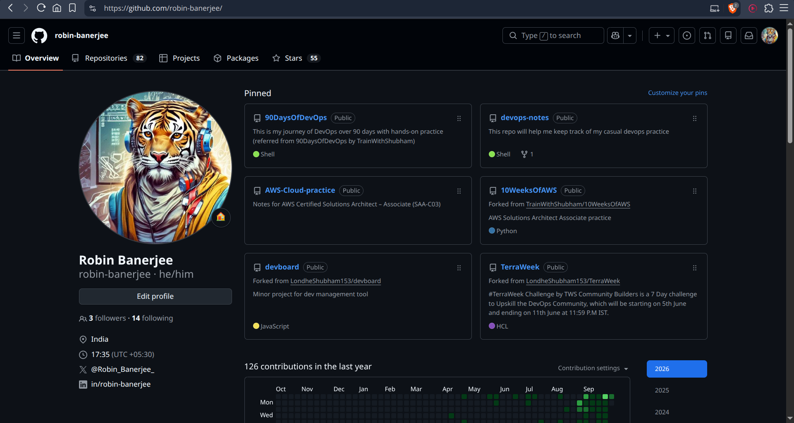
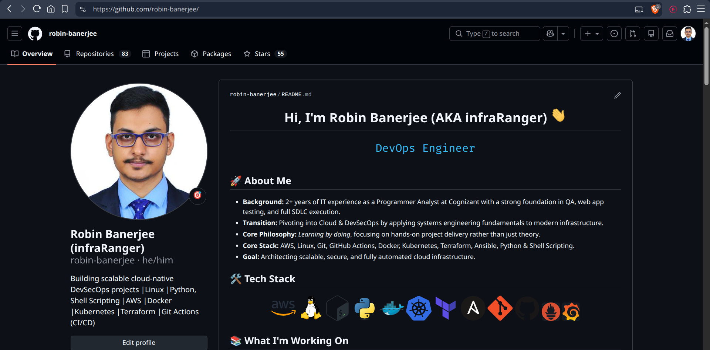
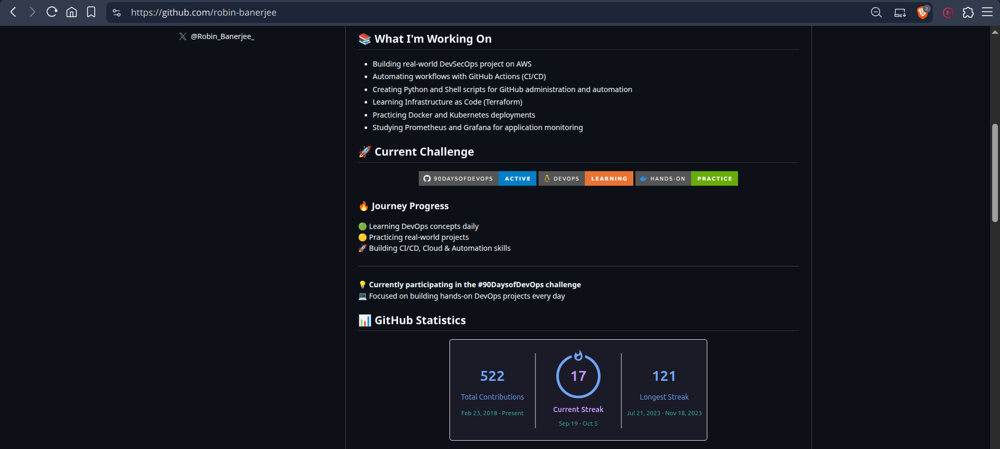
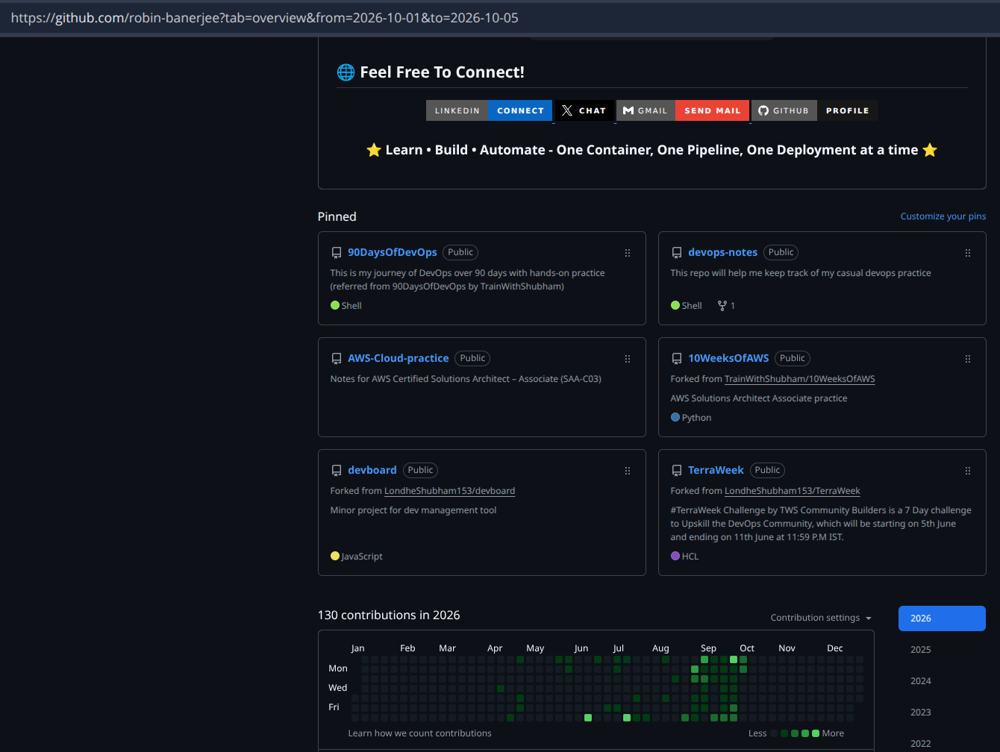

# Day 27 – GitHub Profile Makeover

## Task 1: Audit Your Current GitHub Profile
Before making changes, assess where you stand:
1. Visit your own GitHub profile as if you were a stranger — what impression does it give?

GitHub Profile Link:

```text
https://github.com/robin-banerjee/
```



- Positive: My profile immediately showcases a strong, continuous commitment to hands-on upskilling through structured, real-world cloud and DevOps challenges like 90DaysOfDevOps and 10WeeksOfAWS.  

- Negative: It currently lacks basic info about me and foundational production-grade or end-to-end proprietary projects that highlight how I design, architect, and troubleshoot complex systems in an enterprise or team environment.


2. Answer in your notes:
   - Is your profile picture professional? - **No**
   - Is your bio filled in? Does it say what you do? - **No**
   - Are your pinned repos relevant, or are they random forks? - **Relevant**
   - Do your repos have descriptions, or are they blank? - **Mostly have description**
   - Would a recruiter understand what you've been working on? - **Yes**
---

## Task 2: Create Your Profile README

* Created a special GitHub profile repository named **[robin-banerjee/robin-banerjee](https://github.com/robin-banerjee/robin-banerjee)**.
* Added a **README.md**, which is displayed on my GitHub profile page.
* Wrote a short introduction about myself, my DevOps learning journey, and career goals.
* Included my current work, including the **90 Days of DevOps** challenge and hands-on projects.
* Listed my technical skills and tools, including **AWS, Linux, Git, GitHub, GitHub Actions, Docker, Kubernetes, Terraform, Ansible, Python & Shell Scripting**.
* Added links to my important repositories to showcase my best projects.
* Included my contact information, including my **LinkedIn**, **X** and **GitHub** profile.
* Kept the profile clean, simple, and focused without overloading it with unnecessary badges or widgets.

---

## Task 3: Organize Your Repositories

- Organized my GitHub repositories to create a clean and professional DevOps portfolio.
- Added meaningful repository descriptions and detailed README.md files.
- Included appropriate .gitignore files.

---

## Task 4: Pin Your Best Repos

- Pinned 6 best repositories on my GitHub profile that appropriately represent my work and learnings.
- Added a description and README to each pinned repository.

---

## Task 5: Clean Up

- Deleted or archived empty, abandoned, or irrelevant repositories.
- Renamed repositories with unclear or confusing names.
- Removed any exposed secrets (API keys, passwords, .env files) and checked commit history for security issues.

---

## Task 6: Before & After


## 📸 After Changes





---

## Improvements Made

- Improvement 1 : Better Profile Branding
    * Reason: Makes profile more professional and recruiter-friendly.

- Improvement 2 : Repository Organization
    * Reason: Easier navigation and project discovery.

- Improvement 3 : Improved Documentation
    * Reason: Demonstrates communication and documentation skills.

---

## What I Learned
Today I improved my GitHub profile to make it more structured, professional, and recruiter-friendly.
